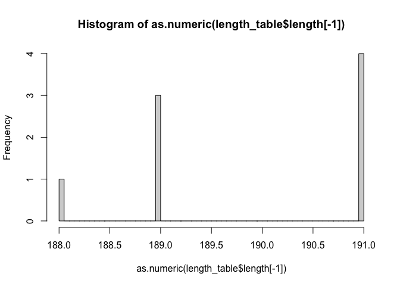
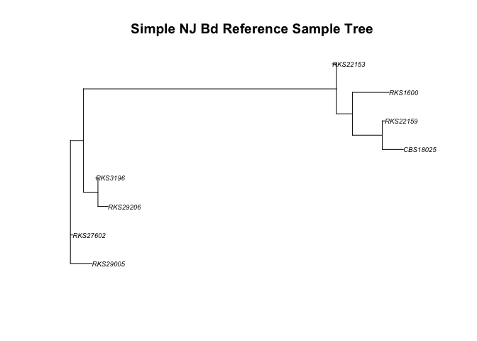

# Lab Manual Procedures # {.tabset}
Includes protocols for working with Bd DNA to create samples to send for sequencing.

## Overview ## {.tabset .tabset-pills}

This lab manual describes how to prepare Bd DNA samples for targeted amplicon sequencing using the Fluidigm Access Array platform. This assay uses a set of 191 primers targeting about 200 base pair amplicons distributed throughout the Bd nuclear and mitochondrial genome, as well as 1 diagnostic primer targeting the Bsal ITS region. See appendix A (a separate excel file) for details on all primer sequences.

### Considerations ###


#### Sample Choice ####
The first consideration when starting a Bd Fluidigm sequencing project is sample choice. We have found that samples with a swab quantity greater than 100 ZE (as measured by qPCR) have a much better probability of sequencing success than swabs with Bd loads <100 ZE. However, if you have important low load swabs, it may be worth it to include these. In this case, it is suggested to include more samples with the understanding that a large proportion of them may not return sequence data.

#### Chip Configuration ####
The next consideration is how many samples you would like to sequence. Fluidigm has two different chip configuration options - either a 48x48 or 192x24 arrangement. For the 48x48 chip, there are 40 wells for DNA samples and 48 wells for primers on each chip (each primer is multiplied 4x). For the 192x24 chip, there are 192 wells for samples and 24 wells for primers (each primer is multiplied 8x). We have found that there are trade-offs when choosing a chip. The 48x48 chip seems to be a bit more sensitive, especially for low quantity swabs. However, you can only include 48 samples on each of these chips. The 192x24 chip is more economical for larger batches of swabs and can work quite well with high DNA input. Choosing the appropriate chip for your project depends on your sample quality, how many samples you would like to sequence, and your budget.

Regardless of your choice of Fluidigm chip, there are a few steps that need to be completed in the lab to prepare your samples for sequencing. First, we have found that cleaning up DNA extracts with an isopropanol precipitation greatly increases sequencing success. Second, after cleaning the DNA we preform a preamplification step to increase the amount of target template DNA before loading samples into the FLuidigm chips. This step uses the same primers with one key difference - the Fluidigm specific tags (tags CS1 and CS2) are not included in the primer sequences. By using un-tagged primers we improve the efficiency of the preamplification PCR. The lab protocols will be described in detail below.

### List of All Materials ###
#### **Materials** ####
Bd DNA extracts (in 1.5ml tubes)

Bd Fluidigm Untagged Primer Pool A

Bd Fluidigm Untagges Primer Pool B

lowTE (10mM Tris-HCl pH 8, 0.1mM EDTA) - see recipe [here](https://openwetware.org/wiki/Luckau_Protocols:Low_TE)

3M Sodium acetate (NaOAc) pH 5.2 - see recipe [here](https://toptipbio.com/sodium-acetate-recipe/)

Isopropanol

70% ethanol (cold)

Molecular grade glycogen (20mg/ml)

Roche High Fidelity FastStart PCR system, dNTPack - item number 4738284001 for 50 reactions or 4738292001 for 200 reactions

ExoSAP-IT 
`&#153;`{=html}
PCR Product Cleanup Reagent

96 well plates for PCR*
*If final sample plates are sent to Idaho IBEST Genomice Resources core use Eppendorf
`&#174;`{=html}
twin-tec PCR plates 96, semi-skirted. Cap these plate with Scientific
`&#153;`{=html}
Domed PCR Caps, strips of 8 (AB0265)

#### **Equipment Needed** ####

Centrifgue for 1.5ml tubes

Centrifuge for plates

Thermocycler

Vortex

10μL, 200μL, 1000μL pipettes and tips. Helps to also have a 10μL multichannel pipette

## Protocols ## {.tabset .tabset-pills}

### Isopropanol Precipitation ###
For cleaning and concentrating DNA extracts

**Materials**

* 1.5 ml tube with DNA sample
* lowTE (10mM Tris-HCl pH 8, 0.1 mM EDTA)
* 3M Sodium acetate (NaOAc)
* 70% ethanol (cold)
* Molecular grade glycogen (20mg/ml)

**Steps**

1. Prepare by placing 70% ethanol in the freezer to chill
2. Bring each DNA sample to 200μL with lowTE (estimate sample volume beforehand)
3. Premix lowTE, NaOAc, and glycogen according to how many samples you are processing, see table below. An example calculation for processing 24 samples (+1 for pipetting error) is included.

<table class=" lightable-minimal lightable-striped lightable-hover" style="font-family: Helvetica Neue; width: auto !important; margin-left: auto; margin-right: auto;">
<caption>Example calculation</caption>
 <thead>
  <tr>
   <th style="text-align:left;"> Reagent </th>
   <th style="text-align:right;"> Per Sample (μL) </th>
   <th style="text-align:right;"> For 25 </th>
  </tr>
 </thead>
<tbody>
  <tr>
   <td style="text-align:left;"> Low TE </td>
   <td style="text-align:right;"> 250.0 </td>
   <td style="text-align:right;"> 6250.0 </td>
  </tr>
  <tr>
   <td style="text-align:left;"> NaOAc </td>
   <td style="text-align:right;"> 50.0 </td>
   <td style="text-align:right;"> 1250.0 </td>
  </tr>
  <tr>
   <td style="text-align:left;"> Glycogen </td>
   <td style="text-align:right;"> 2.5 </td>
   <td style="text-align:right;"> 62.5 </td>
  </tr>
  <tr>
   <td style="text-align:left;"> Total </td>
   <td style="text-align:right;"> 302.5 </td>
   <td style="text-align:right;"> 7562.5 </td>
  </tr>
</tbody>
</table>
4. Add 302.5μL of premix from step 3 to each sample (bringing the sample volume to 502.5μL).
5. Add 500μL of isopropanol, invert 10x
6. Put samples in fridge (4°C) overnight - it is okay if you need to leave for up to 48 hours
*Next Day*
7. Spin samples at 13,000xG for 10min. If there is no pellet after first spin, repeat for another 10min.
8. Decant supernatant by carefully pouring out the liquid and pulling the rest of the liquid out with a 200μL pipette. (You can also use a 1000μL pipette if you don't want to pour. There is a small risk of pouring out the pellet, so be careful.) Do not let the pellet dry at this stage.
9. Wash by adding 500μL of cold 70% ethanol to each tube (flick and invert to dislodge pellet). Some pellets become very stuck and cannot be dislodged, this is okay.
10. Let tubes sit at room temperature for 5min.
11. Spin tubes for 1min at 13,000xG to get pellet to the bottom of the tube.
12. Decant ethanol with 1000μL, 100μL, and 10μL pipettes respectively. (Do not pour off the ethanol at this stage because the pellet is quite loose and can easily be poured out). Let pellet dry (you can use autoclaved toothpicks to get rid of ethanol droplets - or just use 10μL pipette tips). You can tell if the pellet is dry when it turns from a whitish color to glassy/clear. Make sure you check for ethanol droplets in the tube - you don't want any ethanol to carry over. Do not over-dry the pellet. Usually drying takes around 5 minutes, but this depends on the temperature of the lab.
13. Resuspend pellet in low TE. You can decide the volume you would like to use. The smaller the volume, the more DNA you can input into the preamplification step. Typically, we resuspend in 10-20μL depending on initial starting volume.
14. Let pellet resuspend in fridge overnight.

### Bd Fluidigm Preamplification Protocol ###
For preamplifying Bd DNA for our target amplicons. Preamp is split into two separate PCRs, one using Primer Pool A and one using Primer Pool B. There are 96 F and R primers in each pool.

**Materials**

* Cleaned DNA samples - 48 per plate
* Bd Fluidigm Untagged Primer Pool A
* Bd Fluidigm Untagged Primer Pool B
* Molecular grade water
* Roche High Fidelity FastStart PCR system
* ExoSAP-IT 
`&#153;`{=html}
* 96 well plates

**Steps**

1. Prepare the Primer Pools (if you receive an aliquot of the primer pool from the Rosenblum Lab, this is already done).

<table class=" lightable-minimal lightable-striped lightable-hover" style="font-family: Helvetica Neue; width: auto !important; margin-left: auto; margin-right: auto;">
<caption>Primer pool preparation</caption>
 <thead>
  <tr>
   <th style="text-align:left;"> Pool </th>
   <th style="text-align:left;"> F Primers </th>
   <th style="text-align:left;"> R Primers </th>
   <th style="text-align:left;"> LowTE </th>
   <th style="text-align:left;"> Total Volume </th>
   <th style="text-align:left;"> Final Concentration (each primer pair) </th>
  </tr>
 </thead>
<tbody>
  <tr>
   <td style="text-align:left;"> Pool A </td>
   <td style="text-align:left;"> 1920μL F Primers (10μL each) </td>
   <td style="text-align:left;"> 1920μL R Primers (10μL each) </td>
   <td style="text-align:left;"> 160μL </td>
   <td style="text-align:left;"> 4000μL </td>
   <td style="text-align:left;"> 500nM </td>
  </tr>
  <tr>
   <td style="text-align:left;"> Pool B </td>
   <td style="text-align:left;"> 1920μL F Primers (10μL each) </td>
   <td style="text-align:left;"> 1920μL R Primers (10μL each) </td>
   <td style="text-align:left;"> 160μL </td>
   <td style="text-align:left;"> 4000μL </td>
   <td style="text-align:left;"> 500nM </td>
  </tr>
</tbody>
</table>
2. Add 10μL each untagged forward and reverse primer to each of the primer pools along with 160μL of lowTE to create Pool A and Pool B. After mixing the primer pools, aliquot into 400μL tubes.
3. Prepare the PC master mixes for each primer pool. Here you will prepare two master mixes - one for primer pool A and one for primer pool B. Mix each for 50 reactions to account for pipetting error. See table below.

<table class=" lightable-minimal lightable-striped lightable-hover" style="font-family: Helvetica Neue; width: auto !important; margin-left: auto; margin-right: auto;">
<caption>PCR master mix preparation</caption>
 <thead>
  <tr>
   <th style="text-align:left;"> Component </th>
   <th style="text-align:right;"> Volume Per Reaction (μL) </th>
   <th style="text-align:right;"> Volume for 50 Reactions (μL) </th>
  </tr>
 </thead>
<tbody>
  <tr>
   <td style="text-align:left;"> 10x FastStart buffer WITH MgCl2 </td>
   <td style="text-align:right;"> 1.00 </td>
   <td style="text-align:right;"> 50 </td>
  </tr>
  <tr>
   <td style="text-align:left;"> 25 mM  MgCl2 </td>
   <td style="text-align:right;"> 1.08 </td>
   <td style="text-align:right;"> 54 </td>
  </tr>
  <tr>
   <td style="text-align:left;"> DMSO </td>
   <td style="text-align:right;"> 0.50 </td>
   <td style="text-align:right;"> 25 </td>
  </tr>
  <tr>
   <td style="text-align:left;"> 10mM PCR Grade Nucleotide Mix </td>
   <td style="text-align:right;"> 0.20 </td>
   <td style="text-align:right;"> 10 </td>
  </tr>
  <tr>
   <td style="text-align:left;"> 5 U/ul FastStart High Fidelity Enzyme Blend </td>
   <td style="text-align:right;"> 0.20 </td>
   <td style="text-align:right;"> 10 </td>
  </tr>
  <tr>
   <td style="text-align:left;"> Primer Pool </td>
   <td style="text-align:right;"> 1.00 </td>
   <td style="text-align:right;"> 50 </td>
  </tr>
  <tr>
   <td style="text-align:left;"> PCR Grade Water </td>
   <td style="text-align:right;"> 5.02 </td>
   <td style="text-align:right;"> 251 </td>
  </tr>
  <tr>
   <td style="text-align:left;"> Total </td>
   <td style="text-align:right;"> 9.00 </td>
   <td style="text-align:right;"> 450 </td>
  </tr>
</tbody>
</table>
4. Add 9μL of mastermix for primer pool A into the first 48 wells of a PCR plate (columns 1-6). Add 9μL of mastermix for primer pool B into the right 48 wells (columns 7-12).
5. Vortex each DNA sample and spin it down briefly. Add 1μL of each sample to one well in the primer pool A half of the plate and one well in the primer pool B half of the plate. The samples should be in the same layout in each half of the plate. (For example, the first sample would be added to well A1 and well A7, the second to B1 and B7). - See example layout below.


6. Seal the plate, vortex for 20 seconds, and spin down for 30 seconds.
7. Place the plate in the thermocycler and run the following protocol.

<table class=" lightable-minimal lightable-striped lightable-hover" style="font-family: Helvetica Neue; width: auto !important; margin-left: auto; margin-right: auto;">
<caption>Thermocycler protocol 1</caption>
 <thead>
  <tr>
   <th style="text-align:left;"> Preamp Stage </th>
   <th style="text-align:left;"> Number of Cycles </th>
  </tr>
 </thead>
<tbody>
  <tr>
   <td style="text-align:left;"> 95  ̊C 10min </td>
   <td style="text-align:left;"> 1 </td>
  </tr>
  <tr>
   <td style="text-align:left;"> 95  ̊C 15sec, 60  ̊C 4min </td>
   <td style="text-align:left;"> 15 </td>
  </tr>
  <tr>
   <td style="text-align:left;"> 4  ̊C </td>
   <td style="text-align:left;"> hold </td>
  </tr>
</tbody>
</table>

**ExoSAP-IT Treatment (for cleaning up primers)**

1. Make a 1:2 diluted mixture of ExoSAP-IT. For the whole plate (96 wells) you can add 200μL PCR grade water to 200μL ExoSAP-IT to get 400μL 1:2 diluted EXOSAP-it. Make this mixture right before adding to the plate. You should not freeze diluted ExoSAP-IT.
2. Add 4μL of 1:2 diluted ExoSAP-IT enzyme mix to each sample well of the 96-well plate.
3. Vortex the plate for 20 seconds and spin down for 30 seconds.
4. Place the plate in the thermocycler and run the following protocol.

<table class=" lightable-minimal lightable-striped lightable-hover" style="font-family: Helvetica Neue; width: auto !important; margin-left: auto; margin-right: auto;">
<caption>Thermocycler protocol 2</caption>
 <thead>
  <tr>
   <th style="text-align:left;"> Preamp Stage </th>
   <th style="text-align:left;"> Number of Cycles </th>
  </tr>
 </thead>
<tbody>
  <tr>
   <td style="text-align:left;"> 37  ̊C 30min </td>
   <td style="text-align:left;"> 1 </td>
  </tr>
  <tr>
   <td style="text-align:left;"> 80  ̊C 15min </td>
   <td style="text-align:left;"> 1 </td>
  </tr>
  <tr>
   <td style="text-align:left;"> 4  ̊C </td>
   <td style="text-align:left;"> hold </td>
  </tr>
</tbody>
</table>

**Prepare a 5-fold Dilution of the Preamp Products**

1. Pipette 13μL of PCR grade water into all 96 wells of a new plate.
2. Add 5μL of the ExoSAP-IT treated preamp products to the new plate with water, keeping the same plate layout. Easiest to use a multichannel pipette.
3. Vortex the plate for 20 seconds and spin down for 30 seconds.

**Prepare the Final Sample Plate**

1. Combine 5μL of the 5-fold diluted products from pool A and pool B into one well. Your final product will be 10μL for each sample in the first 48 wells of a 96 well plate (use Eppendorf twintec semi-skirted plates with domed caps for Idaho IBEST genomics resources core).

## Post-Preamp Instructions ##

Once you have your samples ready, you can send them off to a sequencing center that has access to Fluidigm equipment. The sequencing center will require both sample plates and a plate of multiplexed primers. This primer plate is prepared by the Rosenblum Lab and can be requested if needed. At the Rosenblum Lab, we have always sent our samples to the [University of Idaho IBEST genomics resources core](https://www.ibest.uidaho.edu/grc.php). They already have a set of primers we use, so they would only require sample plates.

# Bd Fluidigm Ambiguity Phylogenetic Trees # {.tabset}
This workflow includes information to make a tree from ambiguities.

## Libraries ## {.tabset .tabset-pills}
+ Here are the libraries you will need to load for the following analyses:

  + Biostrings

  + phangorn

  + stringr

  + tidyverse

  + seqinr

  + XVector

  + muscle

  + seqRFLP

  + ips


```r
library(Biostrings)
library(phangorn)
library(stringr)
library(tidyverse)
library(seqinr)
library(XVector)
library(muscle)
library(seqRFLP)
library(ips)
```


## Workflow ##

1. First, we must designate a folder to work with that includes the set of ambiguities sequences for our samples and for our reference sequences. You can specify which folder you want to work with when you start your R project to avoid resetting your working directory, as the first comment suggests. Then, list the files in your folder containing the ambiguities.


```r
#Change this to match your local folder if you did not specify the folder when creating your project. In Rmd, the working directory will reset for each R chunk to the project directory. So if using Rmd, you may have to repeat this call as you go through your analysis.
setwd("~/BdFluidigm/raw_ambig/")

#Now let's list the files in your folder
files <- list.files("~/BdFluidigm/raw_ambig/")
```


```
## [1] "Sample.CBS18025.fasta" "Sample.RKS1600.fasta"  "Sample.RKS22153.fasta"
## [4] "Sample.RKS22159.fasta" "Sample.RKS27602.fasta" "Sample.RKS29005.fasta"
## [7] "Sample.RKS29206.fasta" "Sample.RKS3196.fasta"
```

**This part you only have to do once (until you have the trim.fasta files)**

2. First, we should replace the PANA primer names with AB primer names that go beyond 194. This function strips the AB from the original primers and codes the PANA primers as 195-243. It also removes all unmerged reads from the file. 

+ Read in the table that contains the primer lookup table - named Panama_primer_lookup_table.csv. For reference, the first three primers in the table are shown.


```r
match_table1 <- read.csv("~/BdFluidigm/Panama_primer_lookup_table.csv")
```

<table class=" lightable-minimal lightable-striped lightable-hover" style="font-family: Helvetica Neue; width: auto !important; margin-left: auto; margin-right: auto;">
<caption>Glimpse of Panama Primer Lookup Table</caption>
 <thead>
  <tr>
   <th style="text-align:right;"> Primer_Number_Tube </th>
   <th style="text-align:left;"> Primer_Number_PANA </th>
  </tr>
 </thead>
<tbody>
  <tr>
   <td style="text-align:right;"> 1 </td>
   <td style="text-align:left;"> AB1 </td>
  </tr>
  <tr>
   <td style="text-align:right;"> 2 </td>
   <td style="text-align:left;"> AB2 </td>
  </tr>
  <tr>
   <td style="text-align:right;"> 3 </td>
   <td style="text-align:left;"> AB3 </td>
  </tr>
</tbody>
</table>

+ Write a function to rename the primers


```r
rename_primers_pana <- function(run_v2_file, match_table1){
  
  file <- readDNAStringSet(run_v2_file)
  
  names <- sapply(names(file), function(x) unlist(strsplit(x, split=":"))[2])
  names <- sapply(names , function(x) unlist(strsplit(x, split="merged"))[1])
  names <- gsub('.{1}$', '', names)
  
  for (i in 1:length(names)){
    match_num <- match(names[i],match_table1[,2])
    if (i==1){
    newnames <- match_table1[match_num,1]
    } else {
    newnames <- append(newnames, match_table1[match_num,1])
    }
  }
  file <- file[which(!is.na(newnames))] 
  newnames <- na.omit(newnames)
  
  names(file) <- newnames
  
  writeXStringSet(file, format="fasta",file=paste(run_v2_file,"_primerfix.fasta",sep='') )
}
```

+ Run the function for all the files


```r
#As stated before, in Rmd files, the working directory defaults to the project directory in each new R chunk. If using Rmd and your project directory was not set to the folder which includes the ambiguities, you will have to use setwd() to set your directory as the ambiguities folder in this R chunk in order to get an output.
setwd("~/BdFluidigm/raw_ambig/")
```

```r
#Run the below for loop

for (i in 1:length(files)){
  rename_primers_pana(files[i], match_table1)
}
```


**This part you only have to do once (until you have the trim.fasta files)**

3. Now we need to remove all the sequences in the files that are either too long (>200bp) or too short (<90). Minimum predicted sequences is 103bp and max is 162bp, so we will add a buffer to that number and trim.

+ First, list the files again. Then select only the files that have "primerfix" in the name.


```r
#list all the files again
files <- list.files("~/BdFluidigm/raw_ambig/")

#select only the files that have "primerfix" in the name
files_p <-grep("primerfix",files,value=TRUE)
```

```
## [1] "Sample.CBS18025.fasta_primerfix.fasta"
## [2] "Sample.RKS1600.fasta_primerfix.fasta" 
## [3] "Sample.RKS22153.fasta_primerfix.fasta"
## [4] "Sample.RKS22159.fasta_primerfix.fasta"
## [5] "Sample.RKS27602.fasta_primerfix.fasta"
## [6] "Sample.RKS29005.fasta_primerfix.fasta"
## [7] "Sample.RKS29206.fasta_primerfix.fasta"
## [8] "Sample.RKS3196.fasta_primerfix.fasta"
```
+ Run this for loop to trim out bad sequences and to write new files with "_trim.fasta on the end.


```r
#As stated before, in Rmd files, the working directory defaults to the project directory in each new R chunk. If using Rmd and your project directory was not set to the folder which includes the ambiguities, you will have to use setwd() to set your directory as the ambiguities folder in this R chunk in order to get an output.
setwd("~/BdFluidigm/raw_ambig/")
```

```r
#trims out bad sequences and writes out a new file with "_trim.fasta" on the end

for (i in 1: length(files_p)){
    seq <- readDNAStringSet(files_p[i])
    keep <- which((width(seq)>90) & (width(seq)<201))
    seq_trim <- seq[keep]
    writeXStringSet(seq_trim, format="fasta",file=paste(files_p[i],"_trim.fasta",sep='') )
}
```
+ List the files again, and select only the trimmed files.

```r
#list files again
files <- list.files("~/BdFluidigm/raw_ambig/")
#select the trimmed files
files_trim <-grep("_trim",files,value=TRUE)
```

```
## [1] "Sample.CBS18025.fasta_primerfix.fasta_trim.fasta"
## [2] "Sample.RKS1600.fasta_primerfix.fasta_trim.fasta" 
## [3] "Sample.RKS22153.fasta_primerfix.fasta_trim.fasta"
## [4] "Sample.RKS22159.fasta_primerfix.fasta_trim.fasta"
## [5] "Sample.RKS27602.fasta_primerfix.fasta_trim.fasta"
## [6] "Sample.RKS29005.fasta_primerfix.fasta_trim.fasta"
## [7] "Sample.RKS29206.fasta_primerfix.fasta_trim.fasta"
## [8] "Sample.RKS3196.fasta_primerfix.fasta_trim.fasta"
```

**Note that after you run the code above and get the "trim.fasta" files, you no don't need to run that part of the code again. You can just start here.**


4. Now, we want to test a missing data cutoff for samples. We will start with a cutoff of at least 50 sequences.

+ First, we create a table with sample names and the length.


```r
#As stated before, in Rmd files, the working directory defaults to the project directory in each new R chunk. If using Rmd and your project directory was not set to the folder which includes the ambiguities, you will have to use setwd() to set your directory as the ambiguities folder in this R chunk in order to get an output.
setwd("~/BdFluidigm/raw_ambig/")

length_table <- tibble(sample = "", length=0, file_trim="")

samplenames <- sapply(files_trim, function(x)unlist(strsplit(x,split=".fasta_primerfix.fasta_trim"))[1])
samplenames <- sapply(samplenames, function(x) unlist(strsplit(x, split="Sample."))[2])
```

```r
#run the below for loop

for (i in 1: length(files_trim)){
   seq <- readDNAStringSet(files_trim[i], format = "fasta")
   length_table <- add_row(length_table, sample=samplenames[i], length=length(seq), file_trim=files_trim[i])
  }
```

<table class=" lightable-minimal lightable-striped lightable-hover" style="font-family: Helvetica Neue; width: auto !important; margin-left: auto; margin-right: auto;">
<caption>Length Table</caption>
 <thead>
  <tr>
   <th style="text-align:left;">   </th>
   <th style="text-align:right;"> X </th>
   <th style="text-align:left;"> sample </th>
   <th style="text-align:right;"> length </th>
   <th style="text-align:left;"> file_trim </th>
  </tr>
 </thead>
<tbody>
  <tr>
   <td style="text-align:left;"> 2 </td>
   <td style="text-align:right;"> 2 </td>
   <td style="text-align:left;"> CBS18025 </td>
   <td style="text-align:right;"> 189 </td>
   <td style="text-align:left;"> Sample.CBS18025.fasta_primerfix.fasta_trim.fasta </td>
  </tr>
  <tr>
   <td style="text-align:left;"> 3 </td>
   <td style="text-align:right;"> 3 </td>
   <td style="text-align:left;"> RKS1600 </td>
   <td style="text-align:right;"> 191 </td>
   <td style="text-align:left;"> Sample.RKS1600.fasta_primerfix.fasta_trim.fasta </td>
  </tr>
  <tr>
   <td style="text-align:left;"> 4 </td>
   <td style="text-align:right;"> 4 </td>
   <td style="text-align:left;"> RKS22153 </td>
   <td style="text-align:right;"> 191 </td>
   <td style="text-align:left;"> Sample.RKS22153.fasta_primerfix.fasta_trim.fasta </td>
  </tr>
  <tr>
   <td style="text-align:left;"> 5 </td>
   <td style="text-align:right;"> 5 </td>
   <td style="text-align:left;"> RKS22159 </td>
   <td style="text-align:right;"> 191 </td>
   <td style="text-align:left;"> Sample.RKS22159.fasta_primerfix.fasta_trim.fasta </td>
  </tr>
  <tr>
   <td style="text-align:left;"> 6 </td>
   <td style="text-align:right;"> 6 </td>
   <td style="text-align:left;"> RKS27602 </td>
   <td style="text-align:right;"> 188 </td>
   <td style="text-align:left;"> Sample.RKS27602.fasta_primerfix.fasta_trim.fasta </td>
  </tr>
  <tr>
   <td style="text-align:left;"> 7 </td>
   <td style="text-align:right;"> 7 </td>
   <td style="text-align:left;"> RKS29005 </td>
   <td style="text-align:right;"> 189 </td>
   <td style="text-align:left;"> Sample.RKS29005.fasta_primerfix.fasta_trim.fasta </td>
  </tr>
  <tr>
   <td style="text-align:left;"> 8 </td>
   <td style="text-align:right;"> 8 </td>
   <td style="text-align:left;"> RKS29206 </td>
   <td style="text-align:right;"> 189 </td>
   <td style="text-align:left;"> Sample.RKS29206.fasta_primerfix.fasta_trim.fasta </td>
  </tr>
  <tr>
   <td style="text-align:left;"> 9 </td>
   <td style="text-align:right;"> 9 </td>
   <td style="text-align:left;"> RKS3196 </td>
   <td style="text-align:right;"> 191 </td>
   <td style="text-align:left;"> Sample.RKS3196.fasta_primerfix.fasta_trim.fasta </td>
  </tr>
</tbody>
</table>
+ Now we visualize the data.

```r
#visualize number of amplicon sequences per 
hist(as.numeric(length_table$length[-1]), breaks=50)
```

<!-- -->

+ Write it out if you want to save this data

```r
write.csv(length_table, file="length_table_raw.csv")
```
+ Now filter based on cutoff - play around with this cutoff based on your data. Shown below are three separate code chunks, corresponding to 50, 100, and 190 sequences respectively.


```r
    #for 50 sequences
    files_50 <- filter(length_table, length>50)
    filenames_50 <- files_50$file_trim
        #check how many samlpes that gives us, it should give 8
        length(filenames_50)
```

```
## [1] 8
```

```r
    #for 100 sequences
    files_100 <- filter(length_table, length>100)
    filenames_100 <- files_100$file_trim
        #check how many samlpes that gives us, it should give 8
        length(filenames_100)
```

```
## [1] 8
```

```r
    #for 190 sequences
    files_190 <- filter(length_table, length>190)
    filenames_190 <- files_190$file_trim
        #check how many samlpes that gives us, it should give 4
        length(filenames_190)
```

```
## [1] 4
```

5. Now that we have the samples selected, let's fill in a matrix m with the sequences for each amplicon. Each row is a sample and each column is a locus. For reference, the first sequence from each sample in the table is shown.


```r
#As stated before, in Rmd files, the working directory defaults to the project directory in each new R chunk. If using Rmd and your project directory was not set to the folder which includes the ambiguities, you will have to use setwd() to set your directory as the ambiguities folder in this R chunk in order to get an output.
setwd("~/BdFluidigm/raw_ambig/")

#creates the matrix
m <-matrix(NA, nrow=nrow(files_100), ncol=243)
colnames(m) <- seq(1,243)
rownames(m) <- files_100$sample

seq_matrix <- as_tibble(m)
```

```r
#fills in the matrix with sequences

for (i in 1:length(filenames_100)){
  
  seq <- readDNAStringSet(filenames_100[i])
  
  for (j in 1:length(seq)){
    
    col_match <- as.numeric(names(seq))
    m[i,col_match[j]] <- as.character(seq[j])
     }
}

#write it out if you want to save this data
write.csv(m, file="m_matrix.csv")
```
<table class=" lightable-minimal lightable-striped lightable-hover" style="font-family: Helvetica Neue; width: auto !important; margin-left: auto; margin-right: auto;">
<caption>Glimpse of Matrix 'm'</caption>
 <thead>
  <tr>
   <th style="text-align:left;"> X </th>
   <th style="text-align:left;"> X1 </th>
  </tr>
 </thead>
<tbody>
  <tr>
   <td style="text-align:left;"> CBS18025 </td>
   <td style="text-align:left;"> ACAAAATAGAGTTTCCAGGCAAGTGTTTTGCTAGTATTCTTGTTTATTTTCAAACCTACACTTTGARTGTTTACCTTTTGGATAAATTTGTCGGTAGTATAKTAACTTTATCATTTATTAGATCTAGTAAATTCAAATGGGAAAA </td>
  </tr>
  <tr>
   <td style="text-align:left;"> RKS1600 </td>
   <td style="text-align:left;"> ACAAAATARAGTTTCCAGGCAAGTGTTTTGCTAGTATTCTTGTTTATTTTCAAACCTACACTTTGARTGTTTACCTTTTGGATAAATTTGTCGGTAGTATAKTAACTTTATCATTTATTAGATCTAGTAAATTCAAATGGGAAAA </td>
  </tr>
  <tr>
   <td style="text-align:left;"> RKS22153 </td>
   <td style="text-align:left;"> ACAAAATAGAGTTTCCAGGCAAGTGTTTTGCTAGTATTCTTGTTTATTTTCAAACCTACACTTTGAATGTTTACCTTTTGGATAAATTTGTCGGTAGTATATTAACTTTATCATTTATTAGATCTAGTAAATTCAAATGGGAAAA </td>
  </tr>
  <tr>
   <td style="text-align:left;"> RKS22159 </td>
   <td style="text-align:left;"> ACAAAATAGAGTTTCCAGGCAAGTGTTTTGCTAGTATTCTTGTTTATTTTCAAAYCTACACTTTGAATGTTTACCTTTTGGATAAATTTGTCGGTAGTATATTAACTTTATCATTTATTAGATCTAGTAAATTCAAATGGGAAAA </td>
  </tr>
  <tr>
   <td style="text-align:left;"> RKS27602 </td>
   <td style="text-align:left;"> ACAAAATAGAGTTTCCAGGCAAGTGTTTTGCTAGTATTCTTGTTTATTTTCAAACCTACACTTTGARTGTTTACCTTTTGGATAAATTTGTCGGTAGTATAKTAACTTTATCATTTATTAGATCTAGTAAATTCAAATGGGAAAA </td>
  </tr>
  <tr>
   <td style="text-align:left;"> RKS29005 </td>
   <td style="text-align:left;"> ACAAAATAGAGTTTCCAGGCAAGTGTTTTGCTAGTATTCTTGTTTATTTTCAAACCTACACTTTGARTGTTTACCTTTTGGATAAATTTGTCGGTAGTATAKTAACTTTATCATTTATTAGATCTAGTAAATTCAAATGGGAAAA </td>
  </tr>
  <tr>
   <td style="text-align:left;"> RKS29206 </td>
   <td style="text-align:left;"> ACAAAATAGAGTTTCCAGGCAAGTGTTTTGCTAGTATTCTTGTTTATTTTCAAACCTACACTTTGARTGTTTACCTTTTGGATAAATTTGTCGGTAGTATAKTAACTTTATCATTTATTAGATCTAGTAAATTCAAATGGGAAAA </td>
  </tr>
  <tr>
   <td style="text-align:left;"> RKS3196 </td>
   <td style="text-align:left;"> ACAAAATAGAGTTTCCAGGCAAGTGTTTTGCTAGTATTCTTGTTTATTTTCAAACCTACACTTTGARTGTTTACCTTTTGGATAAATTTGTCGGTAGTATAKTAACTTTATCATTTATTAGATCTAGTAAATTCAAATGGGAAAA </td>
  </tr>
</tbody>
</table>
6. Now we have a matrix m with samples as rows and primers as columns. First we can eliminate primers with no data. Let's get the average length of each sequence to determine which has no data. We can also find the min, max, and mean sequence length to identify potential bad sequences. 


```r
#check the dimensions of m
dim(m)
```

```
## [1]   8 244
```

```r
n_bases <- matrix(NA, nrow=ncol(m), ncol=7)
n_bases[,1] <- colnames(m)
  
for (i in 1:ncol(m)){
 n_bases[i,2] <- mean(nchar(m[,i]),na.rm=T)
  n_bases[i,3] <- min(nchar(m[,i]),na.rm=T)
  n_bases[i,4] <- max(nchar(m[,i]),na.rm=T)
  n_bases[i,5] <- median(nchar(m[,i]),na.rm=T)
  n_bases[i,6] <- max(nchar(m[,i]),na.rm=T) - min(nchar(m[,i]),na.rm=T)
  n_bases[i,7] <- sum(is.na(m[,i]))
}
colnames(n_bases) <- c("amp","mean","min","max","median","diff","n_missing")
```
<table class=" lightable-minimal lightable-striped lightable-hover" style="font-family: Helvetica Neue; width: auto !important; margin-left: auto; margin-right: auto;">
<caption>Glimpse of n_bases Matrix</caption>
 <thead>
  <tr>
   <th style="text-align:left;"> amp </th>
   <th style="text-align:left;"> mean </th>
   <th style="text-align:left;"> min </th>
   <th style="text-align:left;"> max </th>
   <th style="text-align:left;"> median </th>
   <th style="text-align:left;"> diff </th>
   <th style="text-align:left;"> n_missing </th>
  </tr>
 </thead>
<tbody>
  <tr>
   <td style="text-align:left;"> X </td>
   <td style="text-align:left;"> 7.75 </td>
   <td style="text-align:left;"> 7 </td>
   <td style="text-align:left;"> 8 </td>
   <td style="text-align:left;"> 8 </td>
   <td style="text-align:left;"> 1 </td>
   <td style="text-align:left;"> 0 </td>
  </tr>
  <tr>
   <td style="text-align:left;"> X1 </td>
   <td style="text-align:left;"> 145 </td>
   <td style="text-align:left;"> 145 </td>
   <td style="text-align:left;"> 145 </td>
   <td style="text-align:left;"> 145 </td>
   <td style="text-align:left;"> 0 </td>
   <td style="text-align:left;"> 0 </td>
  </tr>
  <tr>
   <td style="text-align:left;"> X2 </td>
   <td style="text-align:left;"> 132 </td>
   <td style="text-align:left;"> 132 </td>
   <td style="text-align:left;"> 132 </td>
   <td style="text-align:left;"> 132 </td>
   <td style="text-align:left;"> 0 </td>
   <td style="text-align:left;"> 0 </td>
  </tr>
  <tr>
   <td style="text-align:left;"> X3 </td>
   <td style="text-align:left;"> 152 </td>
   <td style="text-align:left;"> 152 </td>
   <td style="text-align:left;"> 152 </td>
   <td style="text-align:left;"> 152 </td>
   <td style="text-align:left;"> 0 </td>
   <td style="text-align:left;"> 0 </td>
  </tr>
  <tr>
   <td style="text-align:left;"> X4 </td>
   <td style="text-align:left;"> 110 </td>
   <td style="text-align:left;"> 110 </td>
   <td style="text-align:left;"> 110 </td>
   <td style="text-align:left;"> 110 </td>
   <td style="text-align:left;"> 0 </td>
   <td style="text-align:left;"> 0 </td>
  </tr>
  <tr>
   <td style="text-align:left;"> X5 </td>
   <td style="text-align:left;"> 160 </td>
   <td style="text-align:left;"> 160 </td>
   <td style="text-align:left;"> 160 </td>
   <td style="text-align:left;"> 160 </td>
   <td style="text-align:left;"> 0 </td>
   <td style="text-align:left;"> 0 </td>
  </tr>
  <tr>
   <td style="text-align:left;"> X6 </td>
   <td style="text-align:left;"> 137 </td>
   <td style="text-align:left;"> 137 </td>
   <td style="text-align:left;"> 137 </td>
   <td style="text-align:left;"> 137 </td>
   <td style="text-align:left;"> 0 </td>
   <td style="text-align:left;"> 0 </td>
  </tr>
  <tr>
   <td style="text-align:left;"> X7 </td>
   <td style="text-align:left;"> 156 </td>
   <td style="text-align:left;"> 156 </td>
   <td style="text-align:left;"> 156 </td>
   <td style="text-align:left;"> 156 </td>
   <td style="text-align:left;"> 0 </td>
   <td style="text-align:left;"> 0 </td>
  </tr>
  <tr>
   <td style="text-align:left;"> X8 </td>
   <td style="text-align:left;"> 117 </td>
   <td style="text-align:left;"> 117 </td>
   <td style="text-align:left;"> 117 </td>
   <td style="text-align:left;"> 117 </td>
   <td style="text-align:left;"> 0 </td>
   <td style="text-align:left;"> 0 </td>
  </tr>
  <tr>
   <td style="text-align:left;"> X9 </td>
   <td style="text-align:left;"> 158.5 </td>
   <td style="text-align:left;"> 157 </td>
   <td style="text-align:left;"> 163 </td>
   <td style="text-align:left;"> 157 </td>
   <td style="text-align:left;"> 6 </td>
   <td style="text-align:left;"> 0 </td>
  </tr>
  <tr>
   <td style="text-align:left;"> X10 </td>
   <td style="text-align:left;"> 121 </td>
   <td style="text-align:left;"> 121 </td>
   <td style="text-align:left;"> 121 </td>
   <td style="text-align:left;"> 121 </td>
   <td style="text-align:left;"> 0 </td>
   <td style="text-align:left;"> 0 </td>
  </tr>
  <tr>
   <td style="text-align:left;"> X11 </td>
   <td style="text-align:left;"> 140 </td>
   <td style="text-align:left;"> 140 </td>
   <td style="text-align:left;"> 140 </td>
   <td style="text-align:left;"> 140 </td>
   <td style="text-align:left;"> 0 </td>
   <td style="text-align:left;"> 0 </td>
  </tr>
  <tr>
   <td style="text-align:left;"> X12 </td>
   <td style="text-align:left;"> 114 </td>
   <td style="text-align:left;"> 114 </td>
   <td style="text-align:left;"> 114 </td>
   <td style="text-align:left;"> 114 </td>
   <td style="text-align:left;"> 0 </td>
   <td style="text-align:left;"> 0 </td>
  </tr>
  <tr>
   <td style="text-align:left;"> X13 </td>
   <td style="text-align:left;"> 113 </td>
   <td style="text-align:left;"> 113 </td>
   <td style="text-align:left;"> 113 </td>
   <td style="text-align:left;"> 113 </td>
   <td style="text-align:left;"> 0 </td>
   <td style="text-align:left;"> 0 </td>
  </tr>
  <tr>
   <td style="text-align:left;"> X14 </td>
   <td style="text-align:left;"> 151 </td>
   <td style="text-align:left;"> 151 </td>
   <td style="text-align:left;"> 151 </td>
   <td style="text-align:left;"> 151 </td>
   <td style="text-align:left;"> 0 </td>
   <td style="text-align:left;"> 0 </td>
  </tr>
  <tr>
   <td style="text-align:left;"> X15 </td>
   <td style="text-align:left;"> 152 </td>
   <td style="text-align:left;"> 152 </td>
   <td style="text-align:left;"> 152 </td>
   <td style="text-align:left;"> 152 </td>
   <td style="text-align:left;"> 0 </td>
   <td style="text-align:left;"> 0 </td>
  </tr>
  <tr>
   <td style="text-align:left;"> X16 </td>
   <td style="text-align:left;"> 151 </td>
   <td style="text-align:left;"> 151 </td>
   <td style="text-align:left;"> 151 </td>
   <td style="text-align:left;"> 151 </td>
   <td style="text-align:left;"> 0 </td>
   <td style="text-align:left;"> 0 </td>
  </tr>
  <tr>
   <td style="text-align:left;"> X17 </td>
   <td style="text-align:left;"> 132 </td>
   <td style="text-align:left;"> 132 </td>
   <td style="text-align:left;"> 132 </td>
   <td style="text-align:left;"> 132 </td>
   <td style="text-align:left;"> 0 </td>
   <td style="text-align:left;"> 0 </td>
  </tr>
  <tr>
   <td style="text-align:left;"> X18 </td>
   <td style="text-align:left;"> 138 </td>
   <td style="text-align:left;"> 138 </td>
   <td style="text-align:left;"> 138 </td>
   <td style="text-align:left;"> 138 </td>
   <td style="text-align:left;"> 0 </td>
   <td style="text-align:left;"> 0 </td>
  </tr>
  <tr>
   <td style="text-align:left;"> X19 </td>
   <td style="text-align:left;"> 138 </td>
   <td style="text-align:left;"> 138 </td>
   <td style="text-align:left;"> 138 </td>
   <td style="text-align:left;"> 138 </td>
   <td style="text-align:left;"> 0 </td>
   <td style="text-align:left;"> 0 </td>
  </tr>
  <tr>
   <td style="text-align:left;"> X20 </td>
   <td style="text-align:left;"> 120 </td>
   <td style="text-align:left;"> 120 </td>
   <td style="text-align:left;"> 120 </td>
   <td style="text-align:left;"> 120 </td>
   <td style="text-align:left;"> 0 </td>
   <td style="text-align:left;"> 0 </td>
  </tr>
  <tr>
   <td style="text-align:left;"> X21 </td>
   <td style="text-align:left;"> NaN </td>
   <td style="text-align:left;"> Inf </td>
   <td style="text-align:left;"> -Inf </td>
   <td style="text-align:left;"> NA </td>
   <td style="text-align:left;"> -Inf </td>
   <td style="text-align:left;"> 8 </td>
  </tr>
  <tr>
   <td style="text-align:left;"> X22 </td>
   <td style="text-align:left;"> 148 </td>
   <td style="text-align:left;"> 148 </td>
   <td style="text-align:left;"> 148 </td>
   <td style="text-align:left;"> 148 </td>
   <td style="text-align:left;"> 0 </td>
   <td style="text-align:left;"> 0 </td>
  </tr>
</tbody>
</table>

7. Now let's explore the problem loci. Here, create a filter for which loci get included. 


```r
#more than 1/3 missing data

badamps <- which(as.numeric(n_bases[,7]) > .33*nrow(m))

#here you can add in the amps that map to multiple loci in the genome (or any other ones you want to exclude specifically)
#badamps <- c(badamps, 193,194)

m_trim <- m[,-badamps]

dim(m_trim)
```

```
## [1]   8 191
```

```r
#now let's redo the stats
n_bases_trim <- n_bases[-badamps,]

for (i in 1:ncol(m_trim)){
  n_bases_trim[i,2] <- mean(nchar(m_trim[,i]),na.rm=T)
  n_bases_trim[i,3] <- min(nchar(m_trim[,i]),na.rm=T)
  n_bases_trim[i,4] <- max(nchar(m_trim[,i]),na.rm=T)
  n_bases_trim[i,5] <- median(nchar(m_trim[,i]),na.rm=T)
  n_bases_trim[i,6] <- max(nchar(m[,i]),na.rm=T) - min(nchar(m[,i]),na.rm=T)
  n_bases_trim[i,7] <- sum(is.na(m_trim[,i]))
}


#looks good, note removal of row X21
```
<table class=" lightable-minimal lightable-striped lightable-hover" style="font-family: Helvetica Neue; width: auto !important; margin-left: auto; margin-right: auto;">
<caption>Glimpse of n_bases_trim Matrix, *note removal of row X21*</caption>
 <thead>
  <tr>
   <th style="text-align:left;"> amp </th>
   <th style="text-align:left;"> mean </th>
   <th style="text-align:left;"> min </th>
   <th style="text-align:left;"> max </th>
   <th style="text-align:left;"> median </th>
   <th style="text-align:left;"> diff </th>
   <th style="text-align:left;"> n_missing </th>
  </tr>
 </thead>
<tbody>
  <tr>
   <td style="text-align:left;"> X </td>
   <td style="text-align:left;"> 7.75 </td>
   <td style="text-align:left;"> 7 </td>
   <td style="text-align:left;"> 8 </td>
   <td style="text-align:left;"> 8 </td>
   <td style="text-align:left;"> 1 </td>
   <td style="text-align:left;"> 0 </td>
  </tr>
  <tr>
   <td style="text-align:left;"> X1 </td>
   <td style="text-align:left;"> 145 </td>
   <td style="text-align:left;"> 145 </td>
   <td style="text-align:left;"> 145 </td>
   <td style="text-align:left;"> 145 </td>
   <td style="text-align:left;"> 0 </td>
   <td style="text-align:left;"> 0 </td>
  </tr>
  <tr>
   <td style="text-align:left;"> X2 </td>
   <td style="text-align:left;"> 132 </td>
   <td style="text-align:left;"> 132 </td>
   <td style="text-align:left;"> 132 </td>
   <td style="text-align:left;"> 132 </td>
   <td style="text-align:left;"> 0 </td>
   <td style="text-align:left;"> 0 </td>
  </tr>
  <tr>
   <td style="text-align:left;"> X3 </td>
   <td style="text-align:left;"> 152 </td>
   <td style="text-align:left;"> 152 </td>
   <td style="text-align:left;"> 152 </td>
   <td style="text-align:left;"> 152 </td>
   <td style="text-align:left;"> 0 </td>
   <td style="text-align:left;"> 0 </td>
  </tr>
  <tr>
   <td style="text-align:left;"> X4 </td>
   <td style="text-align:left;"> 110 </td>
   <td style="text-align:left;"> 110 </td>
   <td style="text-align:left;"> 110 </td>
   <td style="text-align:left;"> 110 </td>
   <td style="text-align:left;"> 0 </td>
   <td style="text-align:left;"> 0 </td>
  </tr>
  <tr>
   <td style="text-align:left;"> X5 </td>
   <td style="text-align:left;"> 160 </td>
   <td style="text-align:left;"> 160 </td>
   <td style="text-align:left;"> 160 </td>
   <td style="text-align:left;"> 160 </td>
   <td style="text-align:left;"> 0 </td>
   <td style="text-align:left;"> 0 </td>
  </tr>
  <tr>
   <td style="text-align:left;"> X6 </td>
   <td style="text-align:left;"> 137 </td>
   <td style="text-align:left;"> 137 </td>
   <td style="text-align:left;"> 137 </td>
   <td style="text-align:left;"> 137 </td>
   <td style="text-align:left;"> 0 </td>
   <td style="text-align:left;"> 0 </td>
  </tr>
  <tr>
   <td style="text-align:left;"> X7 </td>
   <td style="text-align:left;"> 156 </td>
   <td style="text-align:left;"> 156 </td>
   <td style="text-align:left;"> 156 </td>
   <td style="text-align:left;"> 156 </td>
   <td style="text-align:left;"> 0 </td>
   <td style="text-align:left;"> 0 </td>
  </tr>
  <tr>
   <td style="text-align:left;"> X8 </td>
   <td style="text-align:left;"> 117 </td>
   <td style="text-align:left;"> 117 </td>
   <td style="text-align:left;"> 117 </td>
   <td style="text-align:left;"> 117 </td>
   <td style="text-align:left;"> 0 </td>
   <td style="text-align:left;"> 0 </td>
  </tr>
  <tr>
   <td style="text-align:left;"> X9 </td>
   <td style="text-align:left;"> 158.5 </td>
   <td style="text-align:left;"> 157 </td>
   <td style="text-align:left;"> 163 </td>
   <td style="text-align:left;"> 157 </td>
   <td style="text-align:left;"> 6 </td>
   <td style="text-align:left;"> 0 </td>
  </tr>
  <tr>
   <td style="text-align:left;"> X10 </td>
   <td style="text-align:left;"> 121 </td>
   <td style="text-align:left;"> 121 </td>
   <td style="text-align:left;"> 121 </td>
   <td style="text-align:left;"> 121 </td>
   <td style="text-align:left;"> 0 </td>
   <td style="text-align:left;"> 0 </td>
  </tr>
  <tr>
   <td style="text-align:left;"> X11 </td>
   <td style="text-align:left;"> 140 </td>
   <td style="text-align:left;"> 140 </td>
   <td style="text-align:left;"> 140 </td>
   <td style="text-align:left;"> 140 </td>
   <td style="text-align:left;"> 0 </td>
   <td style="text-align:left;"> 0 </td>
  </tr>
  <tr>
   <td style="text-align:left;"> X12 </td>
   <td style="text-align:left;"> 114 </td>
   <td style="text-align:left;"> 114 </td>
   <td style="text-align:left;"> 114 </td>
   <td style="text-align:left;"> 114 </td>
   <td style="text-align:left;"> 0 </td>
   <td style="text-align:left;"> 0 </td>
  </tr>
  <tr>
   <td style="text-align:left;"> X13 </td>
   <td style="text-align:left;"> 113 </td>
   <td style="text-align:left;"> 113 </td>
   <td style="text-align:left;"> 113 </td>
   <td style="text-align:left;"> 113 </td>
   <td style="text-align:left;"> 0 </td>
   <td style="text-align:left;"> 0 </td>
  </tr>
  <tr>
   <td style="text-align:left;"> X14 </td>
   <td style="text-align:left;"> 151 </td>
   <td style="text-align:left;"> 151 </td>
   <td style="text-align:left;"> 151 </td>
   <td style="text-align:left;"> 151 </td>
   <td style="text-align:left;"> 0 </td>
   <td style="text-align:left;"> 0 </td>
  </tr>
  <tr>
   <td style="text-align:left;"> X15 </td>
   <td style="text-align:left;"> 152 </td>
   <td style="text-align:left;"> 152 </td>
   <td style="text-align:left;"> 152 </td>
   <td style="text-align:left;"> 152 </td>
   <td style="text-align:left;"> 0 </td>
   <td style="text-align:left;"> 0 </td>
  </tr>
  <tr>
   <td style="text-align:left;"> X16 </td>
   <td style="text-align:left;"> 151 </td>
   <td style="text-align:left;"> 151 </td>
   <td style="text-align:left;"> 151 </td>
   <td style="text-align:left;"> 151 </td>
   <td style="text-align:left;"> 0 </td>
   <td style="text-align:left;"> 0 </td>
  </tr>
  <tr>
   <td style="text-align:left;"> X17 </td>
   <td style="text-align:left;"> 132 </td>
   <td style="text-align:left;"> 132 </td>
   <td style="text-align:left;"> 132 </td>
   <td style="text-align:left;"> 132 </td>
   <td style="text-align:left;"> 0 </td>
   <td style="text-align:left;"> 0 </td>
  </tr>
  <tr>
   <td style="text-align:left;"> X18 </td>
   <td style="text-align:left;"> 138 </td>
   <td style="text-align:left;"> 138 </td>
   <td style="text-align:left;"> 138 </td>
   <td style="text-align:left;"> 138 </td>
   <td style="text-align:left;"> 0 </td>
   <td style="text-align:left;"> 0 </td>
  </tr>
  <tr>
   <td style="text-align:left;"> X19 </td>
   <td style="text-align:left;"> 138 </td>
   <td style="text-align:left;"> 138 </td>
   <td style="text-align:left;"> 138 </td>
   <td style="text-align:left;"> 138 </td>
   <td style="text-align:left;"> 0 </td>
   <td style="text-align:left;"> 0 </td>
  </tr>
  <tr>
   <td style="text-align:left;"> X20 </td>
   <td style="text-align:left;"> 120 </td>
   <td style="text-align:left;"> 120 </td>
   <td style="text-align:left;"> 120 </td>
   <td style="text-align:left;"> 120 </td>
   <td style="text-align:left;"> 0 </td>
   <td style="text-align:left;"> 0 </td>
  </tr>
  <tr>
   <td style="text-align:left;"> X22 </td>
   <td style="text-align:left;"> 148 </td>
   <td style="text-align:left;"> 148 </td>
   <td style="text-align:left;"> 148 </td>
   <td style="text-align:left;"> 148 </td>
   <td style="text-align:left;"> -Inf </td>
   <td style="text-align:left;"> 0 </td>
  </tr>
</tbody>
</table>
8. Now let's make another length table to see how many amplicons are in the final dataset

```r
#As stated before, in Rmd files, the working directory defaults to the project directory in each new R chunk. If using Rmd and your project directory was not set to the folder which includes the ambiguities, you will have to use setwd() to set your directory as the ambiguities folder in this R chunk in order to get an output.
setwd("~/BdFluidigm/raw_ambig/")

#create an empty table to populate

length_table_2 <- tibble(sample = "", length=0)
```

```r
for (i in 1: nrow(m_trim)){
    length_table_2 <- add_row(length_table_2, sample=rownames(m_trim)[i], length=sum(!is.na(m_trim[i,])))
  }

#write it out if you want to save this data
write.csv(length_table_2, "final_number_of_loci_trimmed.csv")
```

<table class=" lightable-minimal lightable-striped lightable-hover" style="font-family: Helvetica Neue; width: auto !important; margin-left: auto; margin-right: auto;">
<caption>Final Number of Loci Trimmed</caption>
 <thead>
  <tr>
   <th style="text-align:left;">   </th>
   <th style="text-align:left;"> sample </th>
   <th style="text-align:right;"> length </th>
  </tr>
 </thead>
<tbody>
  <tr>
   <td style="text-align:left;"> 2 </td>
   <td style="text-align:left;"> CBS18025 </td>
   <td style="text-align:right;"> 189 </td>
  </tr>
  <tr>
   <td style="text-align:left;"> 3 </td>
   <td style="text-align:left;"> RKS1600 </td>
   <td style="text-align:right;"> 190 </td>
  </tr>
  <tr>
   <td style="text-align:left;"> 4 </td>
   <td style="text-align:left;"> RKS22153 </td>
   <td style="text-align:right;"> 190 </td>
  </tr>
  <tr>
   <td style="text-align:left;"> 5 </td>
   <td style="text-align:left;"> RKS22159 </td>
   <td style="text-align:right;"> 190 </td>
  </tr>
  <tr>
   <td style="text-align:left;"> 6 </td>
   <td style="text-align:left;"> RKS27602 </td>
   <td style="text-align:right;"> 188 </td>
  </tr>
  <tr>
   <td style="text-align:left;"> 7 </td>
   <td style="text-align:left;"> RKS29005 </td>
   <td style="text-align:right;"> 189 </td>
  </tr>
  <tr>
   <td style="text-align:left;"> 8 </td>
   <td style="text-align:left;"> RKS29206 </td>
   <td style="text-align:right;"> 189 </td>
  </tr>
  <tr>
   <td style="text-align:left;"> 9 </td>
   <td style="text-align:left;"> RKS3196 </td>
   <td style="text-align:right;"> 190 </td>
  </tr>
</tbody>
</table>
9. For each sample with data, aligns all loci separately. This is done only for the gene tree > species tree approach.
+ This part can be slow for lots of samples. It writes out a file in the working directory of each separate locus alignment.


```r
#aligns all seqs (removing those with NAs) and writes them out as a separate fasta

for (i in 1:ncol(m_trim)){
  
  locus_list <- m_trim[!is.na(m_trim[,i]),i]
  locus_seq <- DNAStringSet(locus_list)
  locus_align <- muscle::muscle(locus_seq)
  locus_align <- DNAStringSet(locus_align)
  writeXStringSet(locus_align, paste(colnames(m_trim)[i], "_align.fasta", sep=""))
  
}
```
10. That was good for making the gene trees. Now if we want to use the concatenation method this is how we do it:

+ Ok, now that we have a clean data matrix (m_trim) we can now fill in the rest of the entries with NNNs. We will use the max amplicon length for the number of times to repeat the Ns


```r
for (i in 1:ncol(m_trim)){
  
  length_seq <- n_bases_trim[i,4]
  
  for (j in 1:nrow(m_trim)){
    
    if (is.na(m_trim[j,i])){
      m_trim[j,i] <- paste(replicate(length_seq, "N"), collapse = "")
    }
    
  }}
```

+ Align all loci separately and then concatenate each locus to form the alignment. 


```r
#makes a copy of m_trim to replace with aligned sequences
m_trim_align <- m_trim
```
+ Align all sequences and populate new data frame with the aligned sequence

```r
for (i in 1:ncol(m_trim)){
  
  locus_seq <- DNAStringSet(m_trim[,i])
  locus_align <- muscle::muscle(locus_seq)
  locus_align <- DNAStringSet(locus_align)
  
    for (j in 1:length(locus_align)){
    
    m_trim_align[j,i] <- as.character(locus_align[j])
     }
  }
```
+ Concatenate

```r
cat_seqs_align <- matrix(NA, nrow=length(filenames_100), ncol=2)

cat_seqs_align[,1] <- rownames(m)

cat_seqs_align[,2] <- apply(m_trim_align, 1, paste, collapse="")

cat_seqs_align_df <- as.data.frame(cat_seqs_align)
```
+ Write it out

```r
df.fasta = dataframe2fas(cat_seqs_align_df, file="cat_seqs_align.fasta")
```
<table class=" lightable-minimal lightable-striped lightable-hover" style="font-family: Helvetica Neue; margin-left: auto; margin-right: auto;">
<caption>Glimpse of cat_seq_align Table</caption>
 <thead>
  <tr>
   <th style="text-align:left;"> V1 </th>
   <th style="text-align:left;"> V2 </th>
  </tr>
 </thead>
<tbody>
  <tr>
   <td style="text-align:left;"> 1 </td>
   <td style="text-align:left;"> CBS18025ACAAAATAGAGTTTCCAGGCAAGTGTTTTGCTAGTATTCTTGTTTATTTTCAAACCTACACTTTGARTGTTTACCTTTTGGATAAATTTGTCGGTAGTATAKTAACTTTATCATTTATTAGATCTAGTAAATTCAAATGGGAAAATATTCTGGCTTGGCTCGCTCCAAAAATGCWCTCTCTCTTATCATGCTGAGCATGCTATCCATGTCTGTTGTAACGATTCAGGTAAGACTCTAAAGCAGATGACTAAATAAAAGTGGAWATCTCGTATCCAATGTRATACTTTGATTTTGTTTCCTGATAGGTTTAATGTCTCTAATGCGACAARTTTAGTGAGTGCTRTTGGTATTGTAGTGAGCCTATTTTGAGCCAAACAAAGGAACTTTAAATTGGACAGATTGCTGATTTCTATAGGTATAGACTCAATATGATCATTATAAAAAATAAAATGGAGTTTCAATTCAATATAAACTAGCAAATGCACATGGGCAGCTAGACAGTGACCTACATTGTTGTTCAATGGATTCAAAAGGAACTGTCAATGCTGTAGGGATARATAAGTTAATTYGAATGAAATTCAACKACAAATAGTTAAAAAGTAAACACTGCACWAACCAGATTGAGTCTGGTGCAAAAGCAGTCGGGTGTCAGCCAGCTCYCTCTCTAATTCCCGTGTMTTGAGCACTTGCTGATCGAAATTTCTGCCACTTGAGAGGTTCCACTTGTACTTGATTTTGAATGTAGCYTGATTCCATTTGCAATATCAATGTTGTATTCTGCATAAATCCAATCGCCGTCAAATCCAGATGCTGAAATAAGCTCTCCACAAATTAATTCCCTATGGCATTTTCTACGCYACCTAARTCTACTACCAARCCCATTCCTGTGCGATCATCCTCCGTTGGTGGATCCAAACAATGTCCCAATACAGAATCTACTCAGCCTTATAATGACAGACCAGACACTACTTYATCTTCATCAGCTATTATTCTTTAAAATACCCTGTTAGCTTTCAATGCATTTTGTATTGAAATACAAGTGATCATATGACTCCATACTCGGTATACCTTTTTATAATGGGGCGAGTTTTGCCCAAAGCGAAAGATGACCTCTCCACATCAGATCTGTACTTTCACAACCACTTTGGCGACCAACACGGGTAGTCYRACAACTACTACCACTACTACTACTACTACCACTACTACTCCAACAACAACTACTACTATCACCAGTGCACCAGAAACTATAACCACAGTGCCTTCCACTACTACTGTAAAAGTAGTCGACACGCCCARCCTTGAACTCGACAACATAAAGAGGAAACTTGAACATCTGGCGTGGAACGGGTGATACGGCYGATACTGGAGACTCGGGAGCGTGATTCATTTGCAGTCGAGATATTCGAAGGTACTGAAAAAAAAGATTTRTCTATTGAGGATGTCTAAATAAAATTTARTAATGGTTGATGTATTCAGCAAATTGCTCATCTAGTTTAACTGTTACATGGAAACAAGTCATCAAATATCTAGAGTATTACCATATCTAGATTTAGTTGGATCAGTTTTGCATTTGTGACCAGTAAGCCCAGCACTTTCATAGGTATCTTTTGTAAGTGAGAGAACTAAATGRCCAGGCTCGATCAATGCCATCGATTCGGAAACTTGCAGTCGAGTCGGATATTGTCAATGTACTGTCGCAAATGCTTGWGATTCTTGACGAGATGAAGCTGGATTTAACCAACTATCGTTTGCAAGCACTAAATGAACCAGTTTTTGGCGAGAGCGCATGCCATTGGATYAGATAGCAAGATGAATAGTGACTGTTGGTAATGTCAGATTCAAACTTCAAGGATGCAATTTYGTCACGTGATTGAGTATTGAGCTGGCAAATAACACAATGAAACCAAGWGCATTAATTCCACCACAATCCTTGTACTAGACTTGCTTTCTACTCATACTGTTTCTATATGCGACCAATGTCTAACCACCATACTTTATTCGATTCAACTTGGTTCAAATAGCGAGTTTGCARCAGAGGAAGTCCAAGATTCTGTATTCCCATTCGTCCTACTCTTTTCATTGAAGTTATTCAGAGAAAAAACCATGAAGGCTTTGGTGCTGGTAACTTTAAGGCTCTTTTCGAGTCTATTGAACTGGAGCAGGACAAGCGTGGCAATCTTTAACTCCCAGACTAACAACATATCCTGACTAAAATTTCCATACAAACCAAAAATGRGCTGCTGCCAGTAAAAATAATGCCAGAAATCCAAWCGAGCCAACCCTAAATARATAATGGCACAATYCGGGAAACAAGAATTAGCGTAAGKGGTTGTAATGTTTACGTTTATAAACTGCCTTTTAAACTTTATGGTGATTTTATACAAGATATAATGGAACTTGATGGGGTTTTYGATAAAGCAGAGACGGAYAAGCGTGTCARTGATATCCGTCACGCTTTTCGAAATGTCATTGAAATCATTTAGTTGTATCWACTGGAGGTTTTACTGGATTCCATGGTTCTTCCRCTAATCCCGGAGTAGACTCGACATYCATGTACAAGAATCGAAACGCATATTCTGGTAGCTCAGCAAGAAATCAAGACAAAGATGTAAGAATGTGTATCAGTTTAACGCCAAGCTACTGAAATCAGATACGCGTAAATTATTACTGCAAAATACCCCAAAAAATGACCCAGATTGGCTGATATCCAGRAACAGAGCTTCAAACAGACATCATACAGCAATAGCTATATACTAGTCCTGTTAGCAGTGTCTAATGATATTTACTGGTAGACTTTTAGGATTTGAAGGAGTCTCTGAAAAAGATGATTTTCCAACATCCATGCTCGAGAAACGTCTTGCTGAAGGGAGCAAAGTAATAGTTTTGGATGACATGGTTTTGCGAAGCAAAACAAGACGTTTCCGAGACAAACTGATTCTGTTGAACTTTTACAGGTGCATGRTGAGTTGTAATATCAGGATTACCGAGTGTAGTATTCAATAACATACAATCCTAACAAATCTAATAGYTATAYCACTTTTGGAGGTGAGTATTTGGCATGATATATGAAAAGYTATTGTTGGAATCTGATAGTGGCAYGATTCYAATTAAAACGCCTATTGTAAAAGATAMTAYCCCTGATTATACTCTATTACCGTTCCTACTATCTTAATAGTTGGTTCAAGATTTATTATCAGTGTCYGTATTTTGCTAATATACAGTATATCAGCAGTTAGTAYTCGCTCTTGACTAGTTATGCTTGGGTTTAATAAGCTTGTCTCAAGACTYGAACCCATTMGTGGTCYCCGTATGAAGTACATTACCGTATAACAAGCTTAATAGARGTATTCATTTCCACTCCCCCAAAATCCCCGCATTCACAATAGTCGATCACATGGTTATGGCCATTGTGTTCAAGTYYCGGTTAAAGTGTATATGCCAAGATACAAAACGGCTAGTTCAAAGGGTTTTTTACAAGATGCATGTCGTGTGTATAGTGGYTCTGATAAACCCAACGTAGGGGCTTSGCGTACGTTATGATGTAAATCAAAAGTCGACTCCTTTTTTCTATCCTCATTATTGGTTTCATATGTTTCCGTCTTTGTAAAGATGCATATTGTCATTTCCTTGCCAATATGTACCTTCAGTRGTCCTCTTTCCTTTAAAAGATGAGATCTGAGTGCCTCCTGATGTTTGATCATCTTCACACTAGACAAGCCATTATATATTGCATCCRCATCTGGTGTTGCATGTAATATCTGATTGTTTTGTAAAACTGTMTGCTCTTGATGTTTTTGAAGAACAGCTTGAYTAGAAATGCTATTTGAACAAATAGCTGGAGCAGGTGATTGCATAACACCTGGCTCATGTAGAGATGTGGATGGGTTGGCATTGTTGGTGTGTAATAGACGCTTTTTTACCATACCAGTACAAACCTGAAATACAGATTCGGCCTCTAAAAAAGCTCGCCAATGGATGTAGATACCAAGACGTTGTAGTTTCCAGATTGGAATTTGGAAATTACCTACGCAAAAATAGGTTTGAGCACATTTCAACACAACTRCTCAAAGTTTGTACCAACTCTTACAAGATCATTCGTTTCCAAATTAATAATCCATCGTTTGCGAGCATCAAGAAGAGCATATCGAGATACTGYCCGAGGATCCTYCTCGTAAAACACACCGTGATTGCATAATCGAACAAGAAAAATGGAAACCACCTTGGCACCTGTCAACTCATACGTCATATCCTAGTTGTGTTTGCATGATTAGATGACAAGATCATCAGATTGACAATAGAAACACGATGCGTCGGTTTAAACACATACCARGATATTTCAATGCATAATACAAATTAAACTATTTTATAGACTATATTCTAGRATTTGGTTCACAAGATGTCCCAAAATGGTAATCCCAAACTGATCRTCCCCYTGCACAAGTGTCATATAAACCGAAGAAAGTATTTCTGGAGTTACATGAATGGCTTTGAATTTTAAACTTTTGRTGGTTCTACTCTCTATCTCACATAGCAGTATATGTTGAARGGGATGAAATRGGCTTAAAAAATTATGGGTGRATAGTGCTACTAATCTAGATAAACTGGATCAATTACAGCGTAGTATTACTACATCTGGAGTAAGCACATTGGATTCAATCCGRTCTCATGGTTTTTCAGGACAAATGGGAACGATGCCTACTGGGTTGAATCATTCTGTTCGACCATCAATGAAAWCCATTCAGGAACAAATCGCTGCCCTAAAAGATACCATGGCATTCAAAAAAGTAGCAAGGTGTATAAACTAGTTAGCAAATCCAGATCCGATACATCAATTGCAGGATTAGACCGTGTATTGCATGTTTCAACAATATARACGATTGATTCTGTACCCCTACTGTAAATAAAGGTGAAAGTTAGTTACAAATTGATTAAACGAATCGATATAGCCAAGCTGATTAGCAACATGATGTTACTAGTATAGATTKCATCCAAGAATAGGATCCAGAAATAGGGATTATGAAGGTCGATTTCTGCAATCAGAGTCTACTAAATCCAGTTATAGCCGGGTCAGTTCTAGCATAGTTATAGCGTAGTTCTAGCGTAGTTGTGAAWTCAAAACACTCGAGATAATGACTCGAGGCAAGCGGGTTTGGAGTCGATAGTGTTTTGGTAAATCCGGCGCGAATCATTTCATGAAATTGGCCGTTTGCTATACTTTGACATCCCTATTTAYCGTTCCATTTTATTGCGATGAGGCTATAACTGATTTTGACTTTGTTAACCAATCGGAGTGCAAATTCTCTCTGGAACATGAGAATTGAGCACCTATATAAATTTAAGTCTAAAAGATTGACAACACATGCGGGTGCATAAAACAAACAATTACCTCCACAAAGGTACTAGATTGAGCTTAAAAGTTTGTACAAGCCTACAGGTATTTACGTTTARCTGCAGACGATTGTTTAGCAATACTGGTTTATCCGTTCAAACCTGRCTGGCACGACTGATTAAAGTAAAAATCAAACAAGGTTAGTTCAAACACTCTGCCTTTTGAATTTGAAAGTATTGACGAGATGGACACTGATATGAGCGATGGTGACACATCCATGAACTTTACTGATATCTACTTTCGCTTTCATCCATCAATGAAGAGATCTACATCGACTCCTATCTCCAGGCATTGGCTCTGTACAAAATCAGCCCTCTCATCACTATTTGCAACGAAGCTACCGGCCTGGGCGAGATTCGAGAGAGGCCTGTGATTCAAGGGGTGGGTAYCCACTATTCGTATATCAAACTCAGTCGTACGTAGCTAGTTTGAAAAATCAATAATATACTTTTTAATCAGCGTATATATATTTAAAAATGTATATAATCTACGAGCTGTATTAGGWAAACACTCGAGACTATTGGGGTTAAGATAACAAGGTATAATAGATATCGAAAAGATTAAAACGGAGGCTCAAAAAAAGATTGAAGATGGTAAATCTACTACTGTCATGTCTCTATTCTGACAAAATACTAATGATTATAATGCAAATGTTAACTAGARTTCAAAGTAACAATATTGGCCAGTGATTTTGAAYTGTTTATTTGAACACCCTTATTTAGTTGTATTTTGTGTGAATACACGACTGTAACTATTCACTGGTTTAAAACAATTTGAARTGGTGAGYGAGGATCTATATACACATACCRCAARAACRATCGGTTAGCTCAAGTCGTATTAAAATCAGTCAAACAGAATTTCAATCTACTCAGCTGTTGAGAAAATCAGGTGTCGAATGAGATGTGYCAAATGTAGCAGATTCAGTTACATGGATCTCGTATTTTTAAACTACRAAGACGACAGTCATCAGAAGTGTTATCTGATCCTTCAGCAATGATTTGTTTTGACGCAGCCTATCAAATTTCTATTATTCTATCACGTTTTACAAAGTATAATCCRGGATTTGCATATGTTGGATGGTTGTTAAGTGTCAAGAGTCGATTAAAACAATCTCTTCCAAGAGATGTTTTACCTGCAAGCATATAACCATGCATAAGACGCTCTTGAACGTATTCACTTTTATCTACATCAATGCCAATACTTTGCATTTTTTTGACAGTTYCTTTGGCAAACGATAGRACAATAAACACCATGGGTTGAATTTACCCGATTATGTGTAGGAAAATCGATAGAAACCATGTGTYGATTCAAGTGAGGAGTACTGAAAACGATTGAATATTTATCGTTGAAYGACACATGCAACAAACAAAGCATTGTTTCCAAATAAGAGTGTATAATRAACAACCCATTTTATAAAATAGTCAGTTAGCGTGGCATACTGCTGGTTTGRTGTATGAGCGTGTACGACCACATTACCTGTCAAGCTGGATGCAGGATATTGTGAGTGGTTTGGCAAAGCTAATTCATAGTAGTCCCGGCACGTGGCTCGAGATTATTTTTGATACGCATGATGGAGACAGCGATGGTCTGCTTACACGTGAGGAGACTATCCATGTATCAGAGACGTTACTTTTTCTAATCTTGGTATTGACTAAACGGATCCAAATTTGATCTGACGGTGCCTGAAAACAAAACAGGCTCTTGTGGAATTACACCAATTCGACGACGAAGATCGCGCAGTCCAATGTGCTTGACATCTACACCATCGATAATAACAGATCCAGAGGTTAAACYTTATTGCTATAAAGCGATATTCATGTTTTTCCTTTTTCCTCCGCTCAATCCTCATTCAAACCAGTATAGTGCTGACCTATCATGACTTTGTATCTAGGTTTCGTCCTGCTGTAGTGAGTAAGGAATTTTCGATCCAACTGATTTCARAAAAATGCCCTACTTTGACTAHCTATCCACTGGAAATGGCGTTGATTATTATACCAACACCTTTTCAATTGGAGTTCGGCAAGTTGTGCGTAACRGACAGTGATTGCATTCTCAGGAATACRACTATACATGACAATTGTCAGAAAATCATTCAACTGTCAAGGAGTTTAAAGCTCGACATTATCCAATAAATTAATATCAATCATGTCATGACTGTTTATAATGTACTTTAGCATCCCATTTTATCAATATCACCTTAGTAGTATAATCTCACCAGTTGATGRAAAATGTGAGATCATTTGTATATGCGAGATCCACGCCTGTGCTTTATTTAATCCAGGATCAAATGGGTTTATACAAAAAAAAAAGATAGATTCTAAACGCTAATATATATGAATAAYACTCATGCAACCTTGCTCGATAATCCAAAGCCAGGCTCACTCCCTGCACTTCCTCGTAGTGTCAATGTGTGTGCTATACCTGTAGCAATCATCACAATTTCAGGAATACAGCTATACATGTCAAGCACCAGGATAARAATCAGTCAACTAATGAGTTTAGATAACATTATATTRGCAGTGGATTTGGTAATTATTCGCACGAGACTGGCTGTTTATTATACGCCCTTATTCGTGTCCGCTGAGCACCAGTAAGCCAGGTTAGCATTGGTTTTAATGGATTGCTCGTGTATTTTGTATTTTCGTGTTATTTCTAGTGTTTTTGTTTTAAGGCTGTAGAATCATCATGGAATACTTTTTAAACTGACAATGGTATTACACTTGATCTACAATCGTAGACGCCRAAGTGATAAATTGACATCGATGCGATCTACAGTTAGATCCCAATATGTCCAGTTTAAATCGACTTCTCCAGGAAGCAAATCTCCTAAACCTTTTGCAGACTTTTCTTTGCGCTTACGTTATTCTACTCAACAAAAAATAGTCAACTAAATGGTATCATGCTTCAATAGATCAACGCAAACTCTTGATCAAAGGATTGTAACAAGGACATTTATATTTTATAATTCAGTAAAAACCAAAACCACTCTTGAAAAAAAGCTATAGTTACAAACGGGCATTCTTCTCAAACGTCCATCAACACTGCGGACAAGTCTTYTAAAACTAGTCTTTTTCCGCCTCAYTCCATCACACCTTTTCATTCAACTGCAGTCCATCTACAGCCACTCAAACATACACTTGGCAACCAACGGTAAGTAAACCTATTGGTATGACAAGACTAAACTTATCGTGTACAATCACTATTGCTCATCAGACTGATTGTATTTATGAATTTATTGGCARACTATTTAGTCGTGGACTTGTTGTAGATGATTTCTTGGCCATCAAAGGTGCGACAGACATCATATGACTARGTACTATATTTAAATATGGTTGTATTTTTGTAATCAGAGGCATTGCTTTACCTGCAGTTGCTTGATCCCCAATATTAACAAAGCATATTTATATATTTGAATCGACGATTAGTGATTCTGAGGTGCTCATTAAACCAATACTGGGACTCGAGCATTCATTTARCTCTGATTGGATGATAAGGTTGGTTGCATGCATTCCTATAGTTTGAAAACAAGATCTATTAATTGTATTGTTGGTTATTTTTGATCAGGGGATTGGCCAAGCTTTCAAATCTCAYGAAATCTGTTTTCTCATTAGATTATAATGAATTATACATTCAAATCTATTTATTTGAATCTTCATTCTGGTTTGGGAGCATTGGATTCGAGCCATTTAATTGATTGCTCCAGATCATCGATCRATATCAATGTCTTTACCTTTTCGWGCCATCCATGCAAGARGCTTCTTTACCATTTCGGGCCGATAGCTGATTGCATGARCCAGTAATGGGTAGATGTGAATAACTTCTGCACTCTGATAACGATCTTCCAAACGAGAATTTTGTGCCAAATGCACTGGTTCTTTTTGAGGYAATACCACGTYTGCACTTTCAACAACAGATCTTTCATTRGKGTTTTGTTTGGCTACAGTAGAACCCAAAGARAATATATYCYGTAAAGGTTYAGAACGTATGTTATCGAACCTCAGCCTGCTGCAAAGAAACCTGTTGCTGAGAAGAAGGTGACCGAGACTCCTGCCATTGTCAAAATACAGACTGACGATCATCCAGCCTCCCCAAAAACTCTCAAGAAACAAGATCTGCCCAGTGAAAAACAGAGGACTATCGTTAGTRTTTCTTCCATGYCACAAAAGTCACATTGATTATTTAGTTGTCAGGTGAGGTTTTATTCATGCTGTTGTCCATCGAAACCACTCAATCTTGGATCYGTCAAATAAAATCTAATATGGCTTRATGGAAATACATAGCTATACACGTAGTAAAATGCCAAATAAATGTTTAGTCGACTGGTGACTGGCATGTATAGTTGAATTTCTAAGCTGCAATCCTTGTACCCTTGARTTAGAGTGTATCTGGGATTTAGAATACAGAAGTTTGAATTGGTAATAGGGTCGTTGCGGTTGATTCTATAGAAACAGCGAAGGATGCTGATATGGTGAGTGCTGGTATGGTCAAAGCAAGCGGGTGCCAGATGGCATCATCCCTTGTTGATGAAATTCCATTGTCTAAATCGGCTGGTCTACTCTTTCCAAAAACTGCAATAACGGGAAGGGCAGTCATGGAACCACCACCAAAAGTCTTGTTCATCTTAGCAGCACGCTCGAGAAGACGGGAGTGAAGGTAGAAGACATCACCAGGATAAGCCTCACGACCTGGAGGACGACGGAGCAAAAGTGACACTTGTAGTGGGACAGTTTTATGATTTGACTGCCAAGGTAGTTATGCTTTATACTTGATTTGCTTTTTGATATCGATTTGGACAATGTGATCAACATTACTTTTAGATTGTCAAAGTTGTTAGTACGTCGCCGTATACACTTGCACTTGTGGACTAGTCTCGTCGGACATTGATTTCCTCAAAGGTRTCACGCTTACACTTGCTTCAAAACTGTTGTGGAATGTTTTTAATTCATTCTTGCTTGGTTCGCGATAACTAGTCCCATGAAATTTTACAGCATATTCAGGTGTAACATGTTCTTTACCCAACGACTATGTTCAGAATATAAAAACAGTGGCTGATGCAGCGGTGATACTGATGTGTACTAGATTGATGGCTGCATGAATTTCTGATTGAACAAGTGGAATTTATTGAACCTGCAATGCGAGTRTTTGTTCAGTTGCTTATACAAAAATAAGCAAAGACCAATCAACTAGAGTTCAGGACACAGTGTTGTCCAGTAAATGTAGTGGCAATTGGTATCAATCATTCATGACTGGCTGTTTAAAAGAGCGTGTCATTTCAATTTCAAACGGTTCATTGGTTTTATGCGAAGCTCCAGTAGTTTCTGGTATTGAATGATGTGATATTTAGATACAAATCAAATTACAGTAGAGTATTTGATCCCAGAATTTAATATTTCATTTTTTGTAGATCCAATTGAYGACATCTAGATCGCCTTTTTCAAACCGAGTTTTGACTGTAKGATGAACTTTTCCCGACTCTTTTKGTTGTCTCACAAATGCTAATCAATAMAGTGTGGTTTACATTGTGCATGCKTTAAACTAAAGCATATGCATAARTTRCTGTAARGCATATACCATCAAGATGAATTCATGCACAGGAGATTGATRGTTTAGTAGGTAAGCAATACGAGTAATCGGATATAAAGCACTATACAACGATGKTTGGTATGGTAGAATATTGCATGCAATGATTACAGATTTCAGACAGTTTCGATAGAACTAATGGATGTATAAAAGATGGAATCGTGAGAAAAAATGAACCAATCACTTTATACATAGTGCAAAGACAAGATAGACCTACGGATCAAGCGATCAAACGAAGCAGTAGCCATCTTCCGGAGTATTCGTGTCAATAWTCCCATCGCCGTCGTCAAYAATATTTAACCTGGGGTCTTGGGTTCTCGGCGTATTTCCTCCCGTGCCAAAGACAGTTGAAGCAAATAATGAAAGTGCTRGTGCAAGTAGTAGTTGCATGTTCTAATTTAAAGTCAAGGCACTGAGGTAAATTACAATTCAATGCAAAGCCTAATTGATGTTAATTTGTAATGGGAATTCAATTTGACAATCAGGTGTGATTAGAGTGAATTGCACGAAATTGGAGAATATTTGAATTATACCGCTGATATTCATGAGTGMTGCTGGCTTCAATAAAGTGATGGTTCGTTTCCATGGATCATCAGTATGTRTATCTGCTGGATTGGACTGTATCGGRGAATGTRTGGTTCTATGTGYATTAGACATTGGAGAAACTGGAGTTGACGATTCTTTTGATCGATYCGTCAGCTTTTTGTGATTGCGGCACGACCCACTTTGGAGTAAGAARATCKSCYTYTCCATCACCACCACCACGACGCTCAAGAATCACAGTATCCTCCTTAGCATTGGGGATAGTGGGGATAGCGATATGTTCAGTCGGATACTATACATGCATCCAAATCCACCACTGGCGACCCAGCGTTTCCACCGTCCCATGACGCCAAAGCAAACAACTTTGCAAAAGACTCCTTGGGATACGTGATTGCACTTATAGTTTTTTCCCCAGGCAACACACGRGCAGTATGGGCCATAATAGWTGGCTTATGTAGAGTGGGTTGACGATTCAAAAGCAGAAAATCGCCATTGCGAATATGACGATATACTTTCTTGTTGACGTGATCAAAGTTATACGAGGGATAGCAATTATTTTTTGGTTCAATATTTGAAGTTCTTTGTGCACAGCAATAAGCTTGCCATCAACGATTCGTTTCACTCCAGAATTTTTTAATCTTTTTTCTGACACTCWTTTGAGTTCGTCGCGTGTTGCAATTTATTGCAATTTCACTGCCATTTATCTTGCTTTGGCTAGATACAGCGCATGTGCAATTTTAACGCTCGTAATACCTCAGCAACCGAGTATTGAGTTTGTATTTCAATCTCCCGTTTTTGGGACCTAATTCGAAATGCACTGCTCTATCGCGTCATTTCCCGTTGCATCCCCACTCATGAAACTACTGACYGGAATTGAGCTATTGCTGATCAAAAGTCAGGACTGGGAAGCGTATGCCAGCAAGGAGGTGTCTCTCAAGATGTGTTTAGATGATATAGTTTTATCCCGTGCACTACCCATCCTTCCCGAACTCCGCTCAAGTGGAGTGCTYCAGCCATAATCCGGCCGATATCTTTTGAAAAYACTCCAACCACCATTTTGGAAGGGCGAGCGGGATTAGTGAGCGGCCCAAGCCTGTAGATAGCTGAATCAACTGTGGTCATGATTTACCTCTTCAGGATACAAGTCCTGCAATCGAGTTCGTGGCATGTGTTCGGTTAAACCATACACTTGGAATCCAAGTTCAATTGCCCGCTATYCGTRCATTCATTAATCAAAACGTCGTTGAATCTCGGCGATTGAATCCACGCAATACATTGCCTGCTCCTGTTGGATGCATTGCTTTAATAGTAGAACCAATACAAAATAAGCAGTGTGGAGATGAAGGATCGACTTCAAATGAACCACATAGCTAAATACAGTAGAATGTATTCGATTTTAGTAGGTAAACAGCCGCACYCAACGTCTGTTAATCAACAGGCATTTTATTTTATTTTGAAATGACAAACCAAGACTGAGTATGATTATAAACCATGTTATTACAAAATTTCAAGCTATTTATACAATCGAGCATTGCTCTTTTCTTTGCACACTYGGCAATACCATTTATTTTTATTCAAAGCTCTGTGCTTTCTTAGTTTCTGATTTCATTAAAGTCGATCTCGACATTTTTAGTAAGTTATATGGKATCCMAGTTTTGCACTCCACCGWGCGAGATAGGCTCGCCAGATCCATCTTGRCAAGAAATGAGTAGTACGAGTGGACAAGTAGAGAGCAATCATGACTCTACGTGACTTGTTACTATCCARAAGAAGACTGAATCCTGCTACAATCTGATTGTGCAGAGTATTTTTTCCAAAAAATTCCGCAAAAAACARTTCCGATTTTGACRTAAATATCAACTCCAATTCTACTYTGYCAGTACAAGTYTTATCTATAGGATGCGCACTCTACAAGTTCGTATTTCTGGTCAAGGAAATGCATCTCTATCTGGCCAAGGACCGRACGGGGATCTAATTGTTACAGTACAGGTATATATTGCTTTTACAAAATCAAATGCCTTGTAGCTTTCATTGTCTTACCATATTACGCTGGGACATTTGTGTAACGCATTGARTATAAGCTTTTGCCTTTTGCTGAAATAATWGATCGTCTGATTGTTTGGAAGGACAGTTGAGAAGCCCAGACAAGTGATCTCGAAATACAGTCGATGCTGCAAGAATCTTACGTCAGCCRTATTCAATCAAGTTAAAATCGAGCACTTATACAGTAGGGTAGTGATAACAGCARTGCATTCACTCACAATCACTGTGCTTTCTCTTTAAACAGTTGCTTCCAACCGATCCTTCTTTTTGGAGGTGGAAAAAGACCAAACACCGATGAAAGAAACTGATTTGTACAATARTGATTTTKAAAATCAATTAGAAATTGACGGCAATTTACCCGAGGAAACAGAACTTGCTCAAAATCCCGCAATCAGTCCCATTGATGGATATGCCATAAAAANNNNNNNNNNNNNNNNNNNNNNNNNNNNNNNNNNNNNNNNNNNNNNNNNNNNNNNNNNNNNNNNNNNNNNNNNNNNNNNNNNNNNNNNNNNNNNNNNNNNNNNNNNNNNNNNNNNNNNNNNNNNNNNNNNNNNNNNNNNNNNNNNNNNNNNNGGGCTGTTGATTCATGACAAGAGACTTAGTATCCGAATTTTAAACATAATCACACAAGACATGAATACCTTTTCATCTGCTTGTTTAGGCGACTCGGACTCGTCCGTTACCCCAACAAGTTGGCAACGATAGTAGGCACAGCTACCTTTACAACATACCCTTTTTGCATCTTTTGGTACTGTTCACCGTATTTCTCCTTTAAAGTATTGTTGATCTATCAGCAGAATTAGTAGACAGATTTAAATCAAGCATAYATACAACTTTCAATAGGACTTACATTTTCATCAATTTTCTGGGGAGACAAGACAAARTATGCAAAACGACCATTAAACGATAAAAGTATGCAAGTTAATATAGGAAATGAAAAGCAGATCCACACAAGTTGTTTATAGTTSCATCCACGTAAAATAAARGCGCCAAAATAMACAAACTTCCAGTCTCATGAAATAATGATTCAACCCAAACAGCACCGAGGGCATAGCTGCAGTTTTACATCAATGTCAAAGTCAAATAAAACCACCCAACATTGAAAGATCACAAGTTTACCTGATAAAGTTGAAGAATGTAGCACCAAAAGACACACCATCAATTATATAATGCACACACAAACTATAGTTYTTTTGATTCTCTCAATACAAATGCAACTCTACATGCCAATCACTCAATATTTGGGTTGGAAAGTTGTAGATTGAACAAGTGATGTACTGAAACTACACCATGTGTTCAGTTATTCATGCAGCCTAATGCCGAGATGAATAGAAATCATTGTCAAGATACAAGTTTGAATTCCAGCCATGACAGTGTAAATACGTAAATGTTGGACAAGATTAGACTGAATGCTACTTACATGACTTCTTTAGTCAAGACAGATAGCAGGTTTTTAGTAACAGACAAKCTGACTACAGGACTGGMATTTATATCACWGCTGGTCTCTCTGCATGAACCTGTTCATCCTATTRCTACCACTGTCACTCTGATAGATATCAAAGCTGCTCTYCCATCTGATTCGTTGTCTTCATTAGACARGTCTTATCATGTCGGTCCCGTACATGGAGAAACACRTTGCATCTTTTTTTTGGTATTGATGTGCCAATGCAATACCGGCACCAACAGGAACCTGAGTTTAAAATCTGTTAATCTTGATTGTATTGGTATTCATGAAAACAAGCTATTACCTGTGCACCAACAATGCCGTTGCTTATACATGAAGCACATGTTGAATTCAAGTACAAGAATGAAGCAAATGAAAGTTTGGCAAAGATGCGAGTAYTTGAATGAATCCAAGACCATTTGACATTAGGAATTGAGGGTTAGGGATGGGTAAATAATTTTCGATGTCTTGAATACAAAAAATAGCAGCCATTTGATTGATTCTGCTGAAAATGACTTGTCGAATGCCATTGTGTTCAACAACTGCGATCATCCTTGTATCTTTGATCATATCTGTCATAATTGAAAAATGTGGCTTTATTATTTTTRCTGATTGGTGTGCATCTGTGTTTTAGGTATTGTTTTGCACTCCATTGATGAGATTCTGCAAAGTATCCGTGAGGCCGATCGCAAGCATGACAACAGTACTTCTACCTTGTCACTTCAACCCGAATTTTCAGCACATGCCATTGGAACCAAGCTATGGGAAAATGAAGATAAAATCGAAGTTGGACAAGATCGAGGTATTGCTGACCAGTCTCATAATATTGAAAAGGAAAAAACAGGGAATCCTTCTGCTCTTTCTAATATGTGGGACTACTTTCAGTAGGCACTCAGCTTTCTAGTTTAAACAAGGTAAATTGAGTTTGATCCTGTTCAAATAGTATTGCAGTTGGATTGACCATTTATGTCATGTTCTGATATATGATTAGAGTGAGCTCAARCATGAYCGGAGARGCGTGGAAACTCTATAATCGTCCAAAGTAAGCCAAAAGTCCATGCAATAGGTTTAAAACACTAGACGATATTATTTCTAAAGCTGGTTTYTAGTTCAATTGTAGTCATGCTGGTACAACCAAACGAATTCAATATTTTTGACAAATCTATCACCAAGAGCGCAAGCAATTGATTGAACAAATGCAGAAAATAGCAGCGCGACTAAAGAATGAAGGTGGTGTTGGATCTGCATTATCTATAGGAATGGAAAGCAATATCACACCTGATAGCTTTAGTGACGGAAACAAATTTATGRATGTTGAAAGTGCTGYTTCACATTCATTAAAAATGGTGGATGAAAATGTGGATATCATTGATGTAGGTGGCCATYYAACCAATCCAGGATCGGATGCAACATGTGAATCTGGGTCCTAAATGAAATACCAATACAATGTAAATCAGAAAATCTAGTCAAAGCATATTAGTCTCGCATCCAATACAAAACTCACAAAGCCAATTGTTTTGATGCTGCTGTAGCAAGAATATGGTTGCTAAGATTGCCAATACACTTGAGAATCTCCTTGACACCAATAACCTGATATACATAATAYTCAAGACATTAGTGTATAACAAACATTGTARATGCAACAACATAACAATACTAACCTCGCTATCATTTAGCATAATCCTGAGTTGAATTTCGTCAATTTGCAAACTCAATACTATATCCTGTCTTGCATGTATAGGCATCCGAAAACTGTGAGRTGATTGTCTATTAAATTTCAAGTTTATGCGTTAAAACYCATATAACAAATGAATCCATTTAAAGAGCCAAAAGTTTATTGTCCCTAAGCAAACTTGTAATGTAGGCTAGTAAGTACTTGTTGAATACCTCCTTGTTTTGATTAAATGTTTTTTCAAGACATTTTTTCCAGTCTCCTCGCTGAGCATATATTTCCAAGCCGACCTAAACTCGCGAGGCGTTTAAAAATAATGCAATCAAGTTAGAATGATATTCTTGGTGTGTCCTGGCTGAATACATAATCTGTCAACCTTACCCTGTATGCATCTTCATATGCGTTGTTTGCACAATTAATGAAGATGACAAAAAAACGGATAATGCAAAAAATACATTTGAAGGAAATCATGTAAATGCAGGAATTGCAACCATACCTGGAAATGTTCAACCTGAAATACAATCTGGAGCCCTGCAAGTTAATGTATGAGTTTGAGTTTGAAACAGGAGTACTAATCGATTCATTATTTGCTAGATTATTCARACAAGTTTAATTAGAAAACAGGATGGATTCAATCAAATGATGACATTTATGATTTCAAATAACAGARTTGATCAAGCTGAAATCATAATCCTTTGTCTAGACAAATAAAAGTTGYCTTGCCCAAACTGTAGCGCTTGAGATGTTCAATACACTTTTGACCGGCTTCTACAGTTTCTACAATAATAGAATCAAGTGCGCCACATGCAGTTGTAATGGCAATATCGTACTTGTCATCAATTTGTTTCACCCTATACAACATAATCATGTAAATCAAAACTTGATGCGCACAAAACTCGACAAATTAATGATGCATCTTACAAGCTGGGTRGTTAGATTGGAAATATCCTGCTCATCATTAACATTCCAAAATCAATCTCGGTAGAATTGAATTCCAAAGTAGCCACGCCAGCATGCACCATCACTGGAACCTTGTGCGTACTATAGGGTRACGAAACTGAAAATACCACTGCAGTTCGAATCTCGTGTATCCTWGTCGGATCATAATGTATACGTTCTCTAGATTGTGCTATTGATCGGAATWYAAATGGTGTCAACAAAGTTTAAATCCAAGTATTCATCAACAGTGCAGATACAACCAATTGAGATGTTTCATCAGTATTCGTTCAAGTATCCCAGCTATTCCAAGCGAAAACAAACTGGATTTTCCCGAGAAATCAGCTCTTTTATTGATATTTCAAGGRCAAACTCCGGGATCTCATGATATTTGTCGCTTATAGTCTCCGTCTTGAAACTAGCTTGCTTCGTGACATGTATGCCTTGACACCAAATTTACCACAAAGCATTGGCACCAGTGTATTGACTATAACAGGAGCAACCGTCACTCCGCAAAACGRTTGGCCGCTAAAGTTGCATTTTTAGAAGATGGAAAAGAGGTCAGGGGAATGTCAGACTGTTACAATCTTTTGGTAAAATTAAACTAATTGCTACCGAGACTAGAYGATTGAAAATGGAAAATTGGCTGYCATTTGTATATCRAAAAACTTGTTTGAATTAAATGATTGCATTTCCAAACAACCTTGRGCCATTACTGGTTCTTCAGCATTCCAGTTTGGGGTTGTAAAACAGGATGTTAGTCTGACCTGATTGTTGTTTAGATCAAGTTTAGCAAATTCTACAGCATCAAAGACTGCCCAAAGTTCGATTTGGCGTGGAGCTGATGTGTGTCGGTCACTAATGGACGTTTGGATATGAGAATGCTCAATGGTCATATCAGTTGGTATGATGGGCTCGGCTACTCGGTACTGGATTTCCCTCAACCAATCAAAAACCTGCTYCGACTACGAGCTCTTCGTCAGCATCCCAGCAATTATTTGATGCGTTTCAATCTGCTCCTACTTCATCGAGTCAACAGCAGCAGCAGCAGGCTCAAACCTCGATGAAAAGCTCGATACTTCGACCACTACCATATATTCCTAAACGTCCAGCAATGGGAATGCAGCACACTGTACCATTATTTTTTGACTCGTTTTTAGAGAATGATCAGCTGTCACAGATTGGGTTTAATTCGACTGTGGATGCTAAGCCGTCTACTGGACTACACGGCTGTAAAATTATATTTCCTTAGATCATGTGATGGTTGCAACTCTGATCTTCAGCTAGACGGCACTGCACACTACAGGCARGCCTTGCTTGATAAGATGCTTTTTGCCAATTATAATGAAGCAAGGTATAAAAATACCTTTTGCTTGAGATACCGCTGACAGATTGAATGATACATTTGATGGGCTTCATAATAGTTTCCCTCTGAAATTGTTGATCATGTAATGAGTAGCATGAAAACCAAATATGTYGGACACTACAAGTTGGTATAAGAGTATTGTATCATCAATGCTAGTTAGATCTTGATTGCACTCAAGTTGGATGAKGTCATCACTGCTGGATGGTCTCAAGTTTTTATCCCATGGTACATTATGGAGTTTGCGCATCTGTGCATCAARACRCTTTCCACTGTTGCAGAAATTCAGTACGCTACACTTGACAAGGCCTTTTCAATTTTTGGTGCTATTCGTAATATTGAAATCAACCAGGGCRAACGCACTGYATTTATTGAATTTGTAAGCAACGATGTTTCTGCCAATGTTGTTGGTAAATCCYTTACTTTTTCAGACACATTATATATATATTTGACTGTTTGRATGCAGCTCYTACTGACATTTTTGATTATTATTATAGTTTCRATCAAATCGATTTACCGCAGTATGRCTCTTATGAACAACTTCGGTCAATGTTACTGACAGCGTCAGTGTTGGATCATTACGTAATGCCTTGCTATCTGTGACTAAATTAAAACAGWGCAGTAAAAGTCCTGGAAATTTGCTCTCAAGATTCACTACAAACTCTTCTGKCAATACTCCGAGTGAGTTTCTAGATTCAATCGATAGTTCCTGATAATGGTACATCAAAGAACAACAGAGGAGGYTTCTCCCTGTTCCATGAAATGGCCACATCAAAATTCTTTCCATCAAGCWAAAGTCGATTGTATTGCCCAATTCTTCCCAACAGCAAAACAACCCTCCTTTTAATTTTGTTTAAATCAAYRTGATCTATATGCTGCTGGCACATTGCATATATGAGATTGATCCAGTTGTGGTAAACTGATTGAAAGCTGTCAGATTAGGAGTAATCACAAGGCAGGTTGGATCAGCACCAATGATGTTGGCAGGAAGTATATTCTCGGCCATCATTGAGGTCTTTGTTCGTGATATGGATCTCAAAGGTATTTATTTTAAAAGTTGTGTTGATACCACTGTTGGCTTGGTATTCACTCTACCCACCTTTCTATCTGTAATGTAGCCGACTTTTTCGACTCTATTTTCTCGCTCACCGAGGCAGATCTTGCAGTTGAAGCGAGTGGAGCATCGACGCATATGTCATTATCGGGACATAGATACCCAGCACACGCTATGAATCAAGAGAGAATGCAAGTAGTTCAATAGTTAGTGAATGAATAGATAAACAAGAGTAGCAGAACAACTCTGATTACCAGTTAAATCAGTGTCAGAAGGAATAGTCCGGTGTAACAAGGCACTTCAAGGTAGCGATCGTRGCACATYTGYATCCGAAACCAATGCCATCAACTCATCTGCATCCGTTTCTCAACCAAAACTGGTCAAACCATCAAGCGTTCAAGTTCAATCTGCATGTTTTAAACTGCACTTTCTGATATTCTGGAAATCTGRATAGATTGTGTTGGAAACTCGATCGTACTCTAAAWGTAAATTCAAAAGGTTGGAAATCATAAGTTGAAACCATTGTGCAGTATTYYCTCAAGTGGTGAGTCTGTCCAAAAGGAGCCGAGTGCTTCTTCAATGCAGATGCTAACCCCTTAGAGTGTGCATGTGCCTGAGAAAATGCTTCAACCAAATCTACTGTTTCTAAAAACGCCGAAAATACCTTTGCTACCACCACATTCGTATAAAATGAAACACTAGACAGAGTGCCAAAAACCAAGAAAAAGCATATTTAAAACTATAGTTTGATTGTGCACATCATATGGTTTCTTTTGTGATTAGCACAATCTGTAATGCGTTTGCTGGTGAAAGCACAGATGAAAARGTTCAACTTCAAATCATCAAGGTRTACGTTTGATTTACGATGCAAAACCCATTGATATATGATTAAACTGACATTCRACGCATTACCTATGTTTTTATATTAACATGAAATCATTAAATATGTCAAATTACATGATAAATAGTCATTGATTCGATATTGTTTTTTAGAGYTTAAACAAGCGATATTCACCATTAAAATTAAAATGGGTTGCAAATCGACTCATTYCTGTTATTGTGAATATCAATGTAGATTGTGTTTGTTCATGGCATTTCAYGTCCAGGAGCATGCTTTCCCTCTTTTATGAATGCCTTGGCTAAAAAAGGCTATCGGATTCTTATTTATGGTAATGATCCGGACAGATTTGAAGAATATAAAATCATATAAAATCATAGAATATCAGAATGAATTCAACATATTTTGCAAGACAATCCAGGCTTGAAATCAACATACGATTGAAGCAGAGAGAGCATCGTTGTCTGTCATCAAGTAATGCAGTCGTTGCTTGCTGGAGTGCGTGATAGTGAATCGCCTTCTTGACAATCGCCTCGTTGGTCTTCGCACAGATCTCTCAAGACTCCATCTTGAGAGTAAATCTCAAGCATTGTTGTGAAAGTACATGCAAGAGACAGATCTGAAGAAATCTGTAAAACTTTGCAAGTATTGGACATAGATCCAGTGTCTGACACTCGTAATATTGCAACAGTAGAGTGTCTCCAGAGTCTCAACRATAAGCATACCAGCTCTCAAAAAGACAAAACGCTGACTCAATATGCCGTACAATCTCAACTCTTTCTGTAATGCTAAGAAAMTCACAATAAAAGTACAAGTGCACTTCATGCAGTTTGGGCACAATAAATGCCCAATATTTACGTGGCARTCCTCCAGAAGAAYTATACTGCACATCAAGCAGATAGTCATCGGCTCCTAATATAAAATAAATATTACAATCATCAGTCAATCTAATAATATAAAAATCAAGGGTGGTGTCTAGTAGCTGAATCTAGTTCAAAACAATGCTTACCCAGACTATCATTGGACGTGGCTTTTTCACGACGAATGTGCTGCTCGCGAGTCTGTAGAGCAAGACGATAGGCTGAATTACCAGCAACATCCTTGGACACGCCAATCAGACGGCCAGGCATGCGACGCTTCATCCTTGAGAAGAGCATAGGCTTCAGCAAGAATCTGCATATCACCGTATTCGATGCCATTGTGRACCATTTTGACATAGTGGCCAGAGCCGCCTTCACCAACCCAGTCGCAGCAAGGTTCYCCACTGCGACGGTCAGGGAAATACCTCTATAAGCCAACAYTAACGACTACGTGTYGTCCTGCTTATACCRTTCGTTTGAATGCTGGTTCTAGTAGTGTGAGTAAAGGGCAGAAGAAAGTACTGAAAAAGATGAAGAGGTACTTGAATCCCCATGCAAACAATGYTCCGTCCTCTAAATTTTAAATGACAAGCCAAACAGTCAATCTAAATATCCAGTCTAATCATTTATGATGAAATTCAAGTTTGATTYTACCAGTAATGGCGAGTGRAAAGTCTATTTCATGCAAAGCATTTGAAATTGTATATTCTTATCTTGACATTCAGTAACATCTGCAATGACTACTGCTCGGATCTCTTCCAAGGTACAAYACATGCTGATCAGTATGTCCTCATGGCAATCATTCTTTTCATATAAAACTAAACYTACGYTACCTCTCCTGTATGTACATTGATTTGTATTGAATGATYTGATCATTGGAACTGGAAACTAATCACTCTTGCACTCATTCATCCGTGACTAATCTCTTTTGATTCRAAAGATCGATACCACATCAAATAATCTATATTTTAAAAACAAAATTCAAATCACAAATCTGCTCGCACTCTCGCTGATGTCTTGTTGGCTTTTTCTTGGTTAATCGCTACYGTTTCCTTGTTCTTKGCTTCTACGTGTGWTTACAGATCTCTCGAAYCTCGTTCCGAGTCCGCTGGAATCTCTTGTGCAGTGACAGCGATTTCCGCTTTATGGCCGCCAATGACCTGGCTACTGTGGTTGCTGGGGATCAGTTTATTCTTGATGATGGATCAGARCGCAAGTTGGTTGCTGCTGTTTTGAAACTTATTGACGATTAGTCATATTTGCCTGTACCATGTCTATAAGCGTCCCCATGTCGATTTGTTTTTACGCAAGGTTTTTATTATTTTGGGTTGAGATGGGTCCTAGACTCTCATTTATCAGTCATCCGAGTAGATGTTTAAACACTATTTTATTGAATGGTCTAGATATCAATCTGTCTGTTGACAGCATTGTTACTCCCTCTGTCACAGCCGTTCCTCGGCAAGATTTTTCCCGTCCATCTCGCAGAAAGCGAAGTGTGAAATCCCTCAAGAGCCAATCGACCGTTGCCAGCACTGCCAGAAGTCCTGCTGCTGGTGGGGATTGAACTGGAATCCAAGTCGTTACAATAGACTGGGGTGCCACGTCGCGTTGYAAATTAGTAATACGTGATGGCATCGAYGCCATACRGTAATGATGTAACCCCATACTTGGAGTTGGTTTGCTATAAGCATAAGGGTTGAGTGTGGGTTACCAGTCTAAAAGCTGCTGTTCACTTGAAACCCCTGCAACYGTATCCATGTGGATAGAGCACAATAAGGGTGCTCAACAAACAGCCAATCTAATGAAATGATGAGTCTTGCCAAATATACTCTTGCTTGATTAGATCTGTCCGACTGTCTTGAACTTGCATTGGCTGACGTATCGCYTGCCAATATTCTATATTTACTACCAATGCTTTATAGTCATTGCTGTCCAGTCTATTGCAAACATTGTCAAGAGTACTTGTGATATTCAAGCTATTTTTGGTATTACCGAGGTTAATCTGGTCAATACTCTTGTTGACTTTGTGTACAGCATCTTGAACAGGATTGGAGGTTTCGCATGCCAATGCAATATCATTAGATTCCAGAGCAGTTTGCCAGCATCAAACCAGCTCACCTGGCATGACCAACATGGGATTTGTCAYAAACGGTTGGCCCGCAAGAATACCAAGYGACTCGACGTCCTTTTTCAGGAACAAAYAACTCCTATACAAGTATAGATCCAGTAGTGGGTATATTATTTTGTGCATTATCTATAGARCTCGCTATATTGGCAGTATCCTCCACATGTGCTTGTTGTACTTTTGTYTCCTGGGTGCTGCYGACATCGGGTTCTGAGGCATCCATACCATAAACGRATRGYTTTTCAGAAATTTCATCTAGAAGTATGTGGYGATTTTGAAACTGCACTGCCTCGTAATCCTTTAGTCGGACTAGATATAGAAATCATTGGTTCTTTAAAACTACTAGGCTGTGGATGGCTTTTTATAGTCAATGYTGGGMTGTTATTCTGAATGAGTCGAGTAAATATATCATCCATACAACATTATACATAATAGACTGTAAGAGTGGAGCATCAGAGTTTATTCATAACCAAAAAGATTAGTTTTCTTTGGGATTGCGAACCACAATATTATATGTTTGGATTTTAGTCGTCGTATCAATGGAGCCATCACTTCCGGGGTTTTGCTTTTATTTTTCCGTTTTGGAATTATTGGTTTTCAGGTTATAGGATTGGCTAGATATAGTTTGCTTGACTTGAAACAGTGAAGCGACGAATTCRCAATAATTCAGGAGARAATGATATTCTTGTGGGTGCATCTATTCCTCAAACACTACGTGCTATTACTGTCAAACTTGCACARGTCAAAGCTATCAAGGATTGATTTGATAGATTGCATGTTTAAACATTAGTTTTATTTGCAGACTWAAATGTGATATTGTAGCGATAWTAAACCCGAGAATCTGCTCTTGCACGATGGAGATTGTCGAGTGTCAGATTTGGGATCATAATAAACAGCAGGAATAGAGTTGAAGACATGTCAAAAATCATGAGAGAGTCRTCTAGACTAATTCAAAACAACAACAATGAAGAACTAGACTTGGAGCGACAAGGTACACAAAAAATACGAACAGCTTCCAGCAGTAGTCACACAAACTAGACCCGCACCAAAAAGTTGATTCCACGGCATACGGCGATTCGAATTCAATCAACAATCCATTGACCGACAAGAATCAAGACCCATYCAAAAATACCCCTAGTCGGAGTTCTGATAGTACATTCCATTTAATCTTCAGATAGCTACCATCTAATAATTCCACCATCCCATTACTAAAAGGTAGTACAGGTAAACCAAAAGATAATATATATAATAAATATAATATGGCTAAGGTTATAAAAGAATAGATATTAATTTTCCATGCCCCTATTCTCTACTCTAATTTTTAATACTTCCTCTGTACTAAATTCTGAGGGGCAATTAAATGGACTAATCGTAATTGTAATCTAATCGTAATTGTATAAAGAAATTGTTTCCCGTAAGTCAATAGGATTATCGTAACAAAGGAAGGTAGGATCAAGTCTTTTCGCGATATACTATAATTGGATCTAGGATAGTAAACTATGGGATTCTCTAACGACAAAGAGGAGGATTATCCCTTAGCAATATATGTGTTTCAAGCTCATATGATGAATTTGAAAAATACTGTTATTCATTTAGTCTTGAKCAAGYGATGTTGATCAAAAGACTTGCAAAARCTGAGGCTCAATTCCCCAAACTATCCAAGAAAACCAATGATAAACGTCATCAGCATGCTGCTCAAAAAAACGATGGATCCCAGTGCCAGACTTTTGTCAATGTAAGTGATGTTTTATGGGTTTAATAGCCAATTTCCTGTACACTCGTCACAGTAACTTTTTCTAACCCCGATTGGTATGCCTGATTTTAGATTCCCGCTGCCGTCGCCATTCTTCTTCTTACCATTCTAGTTGTAGGTCTTGCAGTAGTGGTAGCTCTTGTGGTAGTTGTGAATCTTGTGGTAGTAGTAGCTTCTGTAGTAGTATCAGCTTCTGTAGTAGTATCAGCAGGTAYGCTGCTAGAGGATGAATCACCACCACATTCAGTAGGAACGGAAAAGTCGTTGTAATTAAACTATTTCTCAATAATTTATAAATTCATACAATCTACTAATTAAAAATAAGTTATTCCTATCAAGGATCAGTTCACCAATAATATATCCGAGTACATTAAAATTATTAGCAAGAGATAATTAATTTAAATGGAATAGGTGGGGACCACAATCACATATCTCAGGGTATAGCGAAATAATCCCTTCAGGAGGATTCTCTTTATAGACTCTAAATATATAATCTAGGTTTACAATAGATCAATTATATAAAAAAGGGGGGTCCCCCCCCCT </td>
  </tr>
  <tr>
   <td style="text-align:left;"> 2 </td>
   <td style="text-align:left;"> RKS1600ACAAAATARAGTTTCCAGGCAAGTGTTTTGCTAGTATTCTTGTTTATTTTCAAACCTACACTTTGARTGTTTACCTTTTGGATAAATTTGTCGGTAGTATAKTAACTTTATCATTTATTAGATCTAGTAAATTCAAATGGGAAAATATTCTGGCTTGGCTCGCTCCAAAAATGCWCTCTCTCTTATCATGCTGAGCATGCTATCCATGTCTGTTGTAACGATTCAGGTAAGACTCTAAAGCAGATGACTAAATAAAAGTGGATATCTCGTATCCAATGTAATACTTTGATTTTGTTTCCTGATAGGTTTAATGTCTCTAATGCGACAAGTTTAGTGAGTGCTRTTGGTATTGTAGTGAGCCTATTTTGAGCCAAACAAAGGAACTTTAAATTGGACAGATTGCTGATTTCTATAGGTATAGACTCAATATGATCATTATAAAAAATAAAATGGAGTTTCAATTCAATATAAACTAGCAAATGCACATGGGCAGCTAGACAGTGACCTACATTGTTGTTCAATGGATTCAAAAGGAACTGTCAATGCTGTAGGGATARATAAGTTAATTYGAATGAAATTCAACGACAAATAGTTAAAAAGTAAACACTGCACTAACCAGATTGAGTCTGGTGCAAAAGCAGTCGGGTGTCAGCCAGCTCYCTCTCTAATTCCCGTGTMTTGAGCACTTGCTGATCGAAATTTCTGCCACTTGAGAGGTTCCACTTGTACTTGATTTTGAATGTAGCTTGATTCCATTTGCAATATCAATGTTGTATTCTGCATAAATCCAATCGCCGTCAAATCCAGATGCTGAAATAAGCTCTCCACAAATTAATTCCCTATGGCATTTTCTACGCTACCTAARTCTACTACCAARCCCATTCCTGTGCGATCATCCTCCGTTGGTGGATCCAAACAATGTCCCAATACAGAATCTACTCAGCCTTATAATGACAGACCAGACACTACTTTATCTTCATCAGCTATTATTCTTTAAAATACCCTGTTAGCTTTCAATGCATTTTGTATTGAAATACAAGTGATCATATGACTCCATACTCGGTATACCTTTTTATAATGGGGCGAGTTTTGCCCAAAGCGAAAGATGACCTCTCCACATCAGATCTGTACTTTCACAACCACTTTGGCGACCAACACGGGTACTCCRACAACAACTACTACTACTACTACCACTACTACTCCAACAACAACTACTACTATCACCAGTGCACCAGAAACTATAACCACAGTGCCTTCCACTACTACTGTAAAAGTAGTCGACACGCCCAGCCTTGAACTCGACAACATAAAGAGGAAACTTGAACATCTGGCGTGGAACGGGTGATACGGCYGATACTGGAGACTCGGGAGCGTGATTCATTTGCAGTCGAGATATTCGAAGGTACTGAAAAAAAAGATTTATCTATTGRGGATGTCYAAATAAAATTTARTAATGGTTGATGTATTCAGCAAATTGCTCATCTAGTTTAACTGTTACATGGARACAAGTCATCAAATATCTAGAGTATTACCATATCTAGATTTAGTTGGATCAGTTTTGCATTTGTGACCAGTAAGCCCAGCACTTTCATAGGTATCTTTTGTAAGTGAGAGAACTAAATGRCCAGGCTCGATCAATGCCATCGATTCGGAAACTTGCAGTCGAGTCGGATATTGTCAATGTACTGTCGCAAATGCTTGAGATTCTTGACGAGATGAAGCTGGATTTAACCAACTATCGTTTGCAAGCACTAAATGAACCAGTTTTTGGCGAGAGCGCATGCCATTGGATTAGATAGCAAGATGAATAGTGACTGTTGGTAATGTCAGATTCAAACTTCAAGGATGCAATTTTGTCACGTGATTGAGTATTGAGCTGGCMAATAACACAATGAAACCAAGTGCATTAATTCCACCACAATCCTTGTACTAGACTTGCTTTCTACTCATACTGTTTCTATATGCGACCAATGTCTAACCACCATACTTTATTCGATTCAACTTGGTTCAAATAGCGAGTTTGCAGCAGAGGAAGTCCAAGATTCTGTATTCCCATKCGTCCTACTCTTTTCATTGAAGTTATTCAGAGAAAAAACCATGAAGGCTTTGGTGCTGGTAACTTTAAGGCTCTTTTCGAGTCTATTGAACTGGAGCAGGACAAGCGTGGCAATCTTTAACTCCCAGACTAACAACATATCCTGACTAAAATTTCCATACAAACCAAAAATGAGCTGCTGCCAGTAAAAATAATGCCAGAAATCCAAACGAGCCAACCCTAAATAAATAATGGCACAATYCGGGAAACAAGAATTAGCGTAAGTGGTTGTAATGTTTACGTTTATAAACTGCCTTTTAAACTTTATGGTGATTTTATACAAGATATAATGGAACTTGATGGGGTTTTYGATAAAGCAGAGACGGAYAAGCGTGTCARTGATATCCGTCACGCTTTTCGAAATGTCATTGAAATCATTTAGTTGTATCAACTGGAGGTTTTACTGGATTCCATGGTTCTTCCRCTAATCCCGGAGTAGACTCGACATCCATGTACAAGAATCGAAACGCATATTCTGGTAGCTCAGCAAGAAATCAAGACAAAGATGTAAGAATGTGTATCAGTTTAACGCCAAGCTACTGAAATCAGATACGCGTAAATTATTACTGCAAAATACCCCAAAAAATGACCCAGATTGGCTGATATCCAGRAACAGAGCTTCAAACAGACATCATACAGCAATAGCTATATACTAGTCCTGTTAGCAGTGTCTAATGATATTTACTGGTAGACTTTTAGGATTTGAAGGAGTCTCTGAAAAAGATGATTTTCCAACATCCATGCTCGAGAAACGTCTTRCTGAAGGGAGCAAAGTAATAGTTTTGGATGACATGGTTTTGCGAAGCAAAACAAGACGTTTCCGAGACAAACTGATTCTGTTGAACTTTTACAGGTGCATGRTGAGTTGTAATATCAGGATTACCGAGTGTAGTATTCAATAACATRCAATCCTAACAAATCYAATAGYTATACCACYTTTGGAGGTGAGTATTTGGCATGATATATGAAAAGYTATTGTTGGAATCTGATAGTGGCATGATTCCAATTAAAACGCCTATTGTAAAAGATAMTAYCCCTGATTATACTCTATTACCGTTCCTACTATCTTAAYAGTTGGTTCAAGATTTATTATCAGTGTCTGTATTTTGCTAATATACAGTATATCAGCAGTTAGTAYTYGCTCTTGACTAGTTATGCTTGGGTTTAATAAGCTTGTCTCAAGACTTGAACCCATTCGTGGTCCCCGTATGAAGTACATTACCGTATAACAAGCTTAATAGAGGTATTCATTTCCACTCCCCCAAAATCCCCGCATTCACAATAGTCGATCACATGGTTATGGCCATTGTGTTCAAGTCTCGGTTAAAGTGTATATGCCAAGATACAAAACGGCTAGTTCAAAGGGTTTTTTACAAGATGCATGTCGTGTGTATAGTGGTTCTGATAAACCCAACGTAGGGGCTTSGCGTACGTTATGATGTAAATCAAAAGTCGACTCCTTTTTTCTATCCTCATTATTGGTTTCATATGTTTCCGTCTTTGTAAAGATGCATATTGTCATTTCCTTGCCAATATGTACCTTCAGTRGTCCTCTTTCCTTTAAAAGATGAGATCTGAGTGCCTCCTGATGTTTGATCATCTTCACACTAGACAAGCCATTATATATTGCATCCACATCTGGTGTTGCATGTAATATCTGATTGTTTTGTAAAACTGTMTGCTCTTGATGTTTTTGAAGAACAGCTTGATTAGAAATGCTATTTGAACAAATAGCTGGAGCAGGTGATTGCATAACACCTGGCTCATGTAGAGATGTGGATGGGTTGGCATTGTTGGTGTGTAATAGACGCTTTTTTACCATACCAGTACAAACCTGAAATACAGATTCGGCCTCTAAAAAAGCTCGCCAATGGATGTAGATACCAAGACGWTGTAGTTTCCAGATTGGAATTTGGRAATTACCTACGCAAAAATAGGTTTGAGCACATTTCAACACAACTRCTCAAAGTTTGTACCAACTCTTACAAGATCATTCGTTTCCAAATTAATAATCCATCGTTTGCGAGCATCAAGAAGAGCATATCGAGATACTGYCCGAGGATCCTTCTCGTAAAACACACCGTGATTGCATAATCGAACAAGAAAAATGGAAACCACCTTGGCACCTGTCAACTCATACGTCATATCCTAGTTGTGTTTGCATGATTAGATGACAAGATCATCAGATTGACAATAGAAACACGATGCGTCGGTTTAAACACATACCARGATATTTCAATGCATAATACAAATTAAACTATTTTATAGACTATATTCTAGAATTTGGTTCACAAGATGTCCCAAAATGGTAATCCCAAACTGATCRTCCCCTTGCACAAGTGTCATATAAACCGAAGAAAGTATTTCTGGAGTTACATGAATGGCTTTGAATTTTAAACTTTTGRTGGTTCTACTCTCTATCTCACATAGCAGTATATGTTGAAAGGGATGAAATGGGCTTAAAAAATTATGGGTGWATAGTGCTACTAATCTAGRKAAACTGGATCAATTACAGCGTAGTATTACTACATCTGGAGTAAGCACATTGGATTCAATCCGATCTCATGGTTTTTCAGGACAAATGGGAACGATGCCTACTGGGTTGAATCATTCTGTTCGACCATCAATGAAATCCATTCAGGAACAAATCGCTGCCCTAAAAGATACCATGGCATTCAAAAAAGTAGCAAGGTGTATAAACTAGTTAGCAAATCCAGATCCGATACATCAATTGCAGGATTAGACCGTGTATTGCATGTTTCAACAATATAAACGATTGATTCTGTACCCCTACTGTAAATAAAGGTGAAAGTTAGTTACAAATTGATTAAACGAATCGATATAGCCAAGCTGATTAGCAACATGATGTTACTAGTATAGATTKCATCCAAGAATAGGATCCAGAAATAGGGATTATGAAGGTCGATTTCTGCAATCAGAGTCTACTAAATCCAGTTATAGCCGGGTCAGTTCTAGCATAGTTATAGCGTAGTTCTAGCGTAGTTGTGAATTCAAAACACTCGAGATAATGACTCGAGGCAAGCGGGTTTGGAGTCGATAGTGTTTTGGTAAATCCGGCGCGAATCATTTCATGAAATTGGCCGTTTGCTATACTTTGACATCCCTATTTAYCGTTCCATTTTATTGCGATGAGGCTATAACTGATTTTGACTTTGTTAACCAATCGGAGTGCAAATTCTCTCTGGAACATGAGAATTGAGCACCTATATAAATTTAAGTCTAAAAGATTGACAACACATGCGGGTGCATAAAACAAACAATTACCTCCACAAAGGTACTAGAYTGAGCTTAAAAGTTTGTACAAGCCTACAGGTATTTACGTTTAGCTGCAGACGATTGTTTAGCAATACTGGTTTATCCGTTCAAACCTGACTGGCACGACTGATTAAAGTAAAAATCAAACAAGGTTAGTTCAAACACTCTGCCTTTTGAATTTGAAAGTATTGACGAGATGGACACTGATATGAGCGATGGTGACACATCCATGAACTTTACTGATATCTACTTTCGCTTTCATCCATCAATGAAGAGATCTACATYGACTCCTATCTCCAGGCATTGGCTCTGTACAAAATCAGCCCTCTCATCACTATTTGCAACGAAGCTACCGGCCTGGGCGAGATTCGAGAGAGGCYTGTGATTCAAGGGGTGGGTATCCACTATTCGTATATCAAACTCAGTCGTACGTAGCTAGTTTGAAAAATCAATAATATACTTTTTAATCAGCGTATATATATTTAAAAATGTATATAATCTACGAGCTGTATTAGGAAAACACTCGAGACTATTGGGGTTAAGATAACAAGGTATAATAGATATYGAAAAGATTAAAACGGAGGCTCAAAAAAAGATTGAAGATGGTAAATCTACTACTGTCATGTCTCTATTCTGACAAAATACTAATGATTATAATGCAAATGTTAACTAGARTTCAAAGTAACAATATTGGCCAGTGATTTTGAAYTGTTTATTTGAACACCCTTATTTAGTTGTAYTTTGTGTGAATACACGACTGTAACTATTCACTGGTTTAAAACAATTTGAAATGGTGAGTGAGGATCTATATACACATACCACAAAAACAATCGGTTAGCTCAAGTCGTATTAAAATCAGTCAAACAGAATTTCAATCTACTCAGCTGTTGAGAAAATCAGGTGTCGAATGAGATGTGTCAAATGTAGCAGATTCAGTTACATGGATCTCGTATTTTTAAACTACAAAGACGACAGTCATCAGAAGTGTTATCTGATCCTTCAGCAATGATTTGTTTTGACGCAGCCTATCAAATTTCTATTATTCTATCACGTTTTACAAAGTATAATCCRGGATTTGCATATGTTGGATGGTTGTTAAGTGTCAAGAGTCGATTAAAACAATCTCTTCCAAGAGATGTTTTACCTGCAAGCATATAACCATGCATAAGACGCTCTTGAACGTATTCACTTTTATCTACATCAATGCCAATACTTTGCATTTTTTTGACAGTTTCTTTGGCAAACGATAGRACAATAAACACCATGGGTTGAATTTACCCGATTATGTGTAGGAAAATCGATAGAAACCATGTGTYGATTCAAGTGAGGAGTACTGAAAACGATTGAATATTTATCGTTGAATGACACATGCAACAAACAAAGCATTGTTTCCAAATAAGAGTGTATAATAAACAACCCATTTTATAAAATAGTCAGTTAGCGTGGCATACTGCTGGTTTGATGTATGAGCGTGTACGACCACATTACCTGTCAAGCTGGATGCAGGATATTGTGAGTGGTTTGGCAAAGCTAATTCATAGTAGTCCCGGCACGTGGCTCGAGATTATTTTTGATACGCATGATGGAGACAGCGATGGTCTGCTTACACGTGAGGAGACTATCCATGTATCAGAGACGTTACTTTTTCTAATCTTGGTATTGACTAAACGGATCCAAATTTGATCTGACGGTGCCTGAAAACAAAACAGGCTCTTGTGGAATTACACCAATTCGACGACGAAGATCGCGCAGTCCAATGTGCTTGACATCTACACCATCGATAATAACAGATCCAGAGGTTAAACTTTATTGCTATAAAGCGATATTCATGTTTTTCCTTTTTCCTCCGCTCAATCCTCATTCAAACCAGTATAGTGCTGACCTATCATGACTTTGTATCTAGGTTTCGTCCTGCTGTAGTGAGTAAGGAATTTTCGATCCAACTGATTTCAAAAAAATGCCCTACTTTGACTATCTATCCACTGGAAATGGCGTTGATTATTATACCAACACCTTTTCAATTGGAGTTCGGCAAGTTGTGCGTAACGGACAGTGATTGCATTCTCAGGAATACAACTATACATGACAATTGTCAGAAAATCATTCAACTGTCAAGGAGTTTAAAGCTCGACATTATCCAATAAATTAATATCAATCATGTCATGACTGTTTATAATGTACTTTAGCATCCCATTTTATCAATATCACCTTAGTAGTATAATCTCACCAGTTGATGAAAAATGTGAGATCATTTGTATATGCGAGATCCACGCCTGTGCTTTATTTAATCCAGGATCAAATGGGTTTATACAAAAAAAAAAGATAGATTCTAAACGCTAATATATATGAATAATACTCATGCAACCTTGCTCGATAATCCAAAGCCAGGCTCACTCCCTGCACTTCCTCGTAGTGTCAATGTGTGTGCTATACCTGTAGCAATCATCACAATTTCAGGAATACAGCTATACATGTCAAGCACCAGGATAAARATCAGTCAACTAATGAGTYTAGATAACATTATATTAGCAGTGGATTTGGTAATTATTCGCACGAGACTGGCTGTTTATTATACGCCCTTATTCGTGTCCGCTGAGCACCAGTAAGCCAGGTTAGCATTGGTTTTAATGGATTGCTCGTGTATTTTGTATTTTCGTGTTATTTCTAGTGTTTTTGTTTTAAGGCTGTAGAATCATCATGGAATACTTTTTAAACTGACAATGGTATTACACTTGATCTACAATCGTAGACGCCAAAGTGATAAATTGACATCGATGCGATCTACAGTTAGATCCCAATATGTCCAGTTTAAATCGACTTCTCCAGGAAGCAAATCTCCTAAACCTTTTGCAGACTTTTCTTTGCGCTTACGTTATTCTACTCAACAAAAAATAGTCAACTAAATGGTATCATGCTTCAATAGATCAACGCAAACTCTTGATCAAAGGATTGTAACAAGGACATTTATATTTTATAATTCAGTAAAAACCAAAACCACTCTTGAAAAAAAGCTATAGTTACAAACGGGCATTCTTCTCAAACGTCCATCAACACTGCGGACAAGTCTTTTAAAACTAGTCTTTTTCCGCCTCACTCCATCACACCTTTTCATTCAACTGCAGTCCATCTACAGCCACTCAAACATACACTTGGCAACCAACGGTAAGTAAACCTATTGGTATGACRAGACTAAACTTATCGTGTACAATCACTATTGCTCATCAGACTGATTGTATTTATGAATTTATTGGCAAACTATTTAGTCGTGGACTTGTTGTAGATGATTTCTTGGCCATCAAAGGTGCGACAGACATCATATGACTAGGTACTATATTTAAATATGGTTGTATTTTTGTAATCAGAGGCATTGCTTTACCTGCAGTTGCTTGATCCCCAATATTAACAAAGCATATTTATATATTTGAATCGACGATTAGTGATTCTGAGGTGCTCATTAAACCAATACTGGGACTCGAGCATTCATTTAGCTCTGATTGGATGATAAGGTTGGTTGCATGCATTCCTATAGTTTGAAAACAAGATCTATTAATTGTATTGTTGGTTATTTTTGATCAGGGGATTGGCCAAGCTTTCAAATCTCATGAAATCTGTTTTCTCATTAGATTATAATGAATTATACATTCAAATCTATTTATTTGAATCTTCATTCTGGTTTGGGAGCATTGGATTCGAGCCATTTAATTGATTGCTCCAGATCATCGATCAATATCAATGTCTTTACCTTTTCGAGCCATCCATGCAAGAAGCTTCTTTACCATTTCGGGCCGATAGCTGATTGCATGAACCAGTAATGGGTAGATGTGAATAACTTCTGCACTCTGATAACGATCTTCCAAACGAGAATTTTGTGCCAAATGCACTGGTTCTTTTTGAGGTAATACCACGTTTGCACTTTCAACAACAGATCTTTCATTAGGGTTTTGTTTGGCTACAGTAGAACCCAAAGAAAATATATTCTGTAAAGGTTTAGAACGTATGTYATCGAACCTCAGCCTGCTGCAAAGAAACCTGTTGCTGAGAAGAAGGTGACCGAGACTCCTGCCATTGTCAAAATACAGACTGACGATCATCCAGCCTCCCCAAAAACTCTCAAGAAACAAGATCTGCCCAGTGAAAAACAGAGGACTATCGTTAGTATTTCTTCCATGYCACAAAAGTCACATTGATTATTTAGTTGTCAGGTGAGGTTTTATTCATGCTGTTGTCCATCGAAACCACTCAATCTTGGATCYGTCAAATAAAATCTAATATGGCTTAATGGAAATACATAGCTATACACGTAGTAAAATGCCAAATAAATGTTTAGTCGACTGGTGACTGGCATGTATAGTTGAATTTCTAAGCTGCAATCCTTGTACCCTTGAATTAGAGTGTATCTGGGATTTAGAATACAGAAGTTTGAATTGGTAATAGGGTCGTTGCGGTTGATTCTATAGAAACAGCGAAGGATGCTGATATGGTGAGTGCTGGTATGGTCAAAGCAAGCGGGTGCCAGATGGCATCATCCCTTGTTGATGAAATTCCATTGTCTAAATCGGCTGGTCTACTCTTTCCAAAAACTGCAATAACGGGAAGGGCAGTCATGGAACCACCACCAAAAGTCTTGTTCATCTTAGCAGCACGCTCGAGAAGACGGGAGTGAAGGTAGAAGACATCACCAGGATAAGCCTCACGACCTGGAGGACGACGGAGCAAAAGTGACACTTGTAGTGGGACAGTTTTATGATTTGACTGCCAAGGTAGTTATGCTTTATACTTGATTTGCTTTTTGATATCGATTTGGACAATGTGATCAACATTACTTTTAGATTGTCAAAGTTGTTAGTACGTCGCCGTATACACTTGCACTTGTGGACTAGTCTCGTCGGACATTGATTTCCTCAAAGGTATCACGCTTACACTTGCTTCAAAACTGTTGTGGAATGTTTTTAATTCATTCTTGCTTGGTTCGCGATAACTAGTCCCATGAAATTTTACAGCATATTCAGGTGTAACATGTTCTTTACCCAACGACTATGTTCAGAATATAAAAACAGTGGCTGATGCAGCGGTGATACTGATGTGTACTAGATTGATGGCTGCATGAATTTCTGATTGAACAAGTGGAATTTATTGAACCTGCAATGCGRGTATTTGTTCAGTTGCTTATACAAAAATAAGCAAAGACCAATCAACTAGAGTTCAGGACACAGTGTTGTCCAGTAAATGTAGTGGCAATTGGTATCAATCATTCATGACTGGCTGKTTAAAAGAGCGTGTCATTTCAATTTCAAACGGTTCATTGGTTTTATGCGAAGCTCCAGTAGTTTCTGGTATTGAATGATGTGATATTTAGATACAAATCAAATTACAGTAGAGTATTTGATCCCAGAATTTAATATTTCATTTTTTGTAGATCCAATTGACGACATCTAGATCGCCTTTTTCAAACCGAGTTTTGACTGTATGATGAACTTTTCCCGACTCTTTTGGTTGTCTCACAAATGCTAATCAATAAAGTGTGGTTTACATTGTGCATGCGTTAAACTAAAGCATATGCATAARTTRCTGTAAAGCATATACCATCAAGATGAATTCATGCACAGGAGATTGATAGTTTAGTAGGTAAGCAATACGAGTAATCGGATATAAAGCACTATACAACGATGGTTGGTATGGTAGAATATTGCATGCAATGATTACAGATTTCAGACAGTTTCGATAGAACTAATGGATGTATAAAAGATGGAATCGTGAGAAAAAATGAACCAATCACTTTATACATAGTGCAAAGACAAGATAGACCTACGGATCAAGCGATCAAACGAAGCAGTAGCCATCTTCCGGAGTATTCRTGTCAATAATCCCATCGCCGTCGTCAACAATATTTAACCTGGGGTCTTGGGTTCTCGGCGTATTTCCTCCCGTGCCAAAGACAGTTGAAGCAAATAATGAAAGTGCTAGTGCAAGTAGTAGTTGCATGTTCTAATTTAAAGTCAAGGCACTGAGGTAAATTACAATTCAATGCAAAGCCTAATTGATGTTAATTTGTAATGGGAATTCAATTTGACAATCAGGTGTGATTAGAGTGAATTGCACGAAATTGGAGAATATTTGAATTATACCGCTGATATTCATGAGTGCTGCTGGCTTCAATAAAGTGATGGTTCGTTTCCATGGATCATCAGTATGTRTATCTGCTGGATTGGACTGTATCGGRGAATGTATGGTTCTATGTGYATTAGACATTGGAGAAACTGGAGTTGACGATTCTTTTKATCGAYYCGTCAGCTTTTTGTGATTGCGGCACGACCCACTTTGGAGTAAGAAAATCKSCYTTTCCATCACCACCACCACGACGCTCAAGAATCACAGTATCCTCCTTAGCATTGGGGATAGTGGKGATAGCGATATGTTCAGTCGGATACTATACATGCATCCAAATCCACCACTGGCGACCCAGCGTTTCCACCGTCCCATGACGCCAAAGCAAACAACTTTGCAAAAGACTCCTTGGGATACGTGATTGCACTTATAGTTTTTTCCCCAGGCAACACRCGRGCAGTATGGGCCATAATAGATGGCTTATGTAGAGTGGGTTGACGRTTCAAAAGCAGAAAATCGCCATTGCGAATATGACGATATACTTTCTTGTTGACGTGATCAAAGTTATAYGAGGGATAGCAATTATTTTTTGGTTCAATATTTGAAGTTCTTTGTGCACAGCAATAAGCTTGCCATCAACGATTCGTTTCACTCCAGAATTTTTTAATCTTTTTTCTGACACTCTTTTGAGTTCGTCGCGTGTTGCAATTTATTGCAATTTCACTGCCATTTATCTTGCTTTGGCTAGATACAGCGCATGTGCAATTTTAACGCTCGTAATACCTCAGCAACCGAGTATTGAGTTTGTATTTCAATCTCCCGTTTTTGGGACCTAATTCGAAATGCACTGCTCYATCGCGTCATTTCCCGTTGCATCCCCACTCATGAAACTACTGACTGGAATTGAGCTATTGCTGATCAAAAGTCAGGACTGGGAAGCGTATGCCAGCAAGGAGGTGTCTCTCAAGATGTGTTTAGATGATATAGTTTTATCCCGTGCACTACCCATCCTTCCCGAACTCCGCTCAAGTGGAGTGCTTCAGCCATAATCCGGCCGATATCTTTTGAAAAYACTCCAACCACCATTTTGGAAGGGCGAGCGGGATTAGTGAGCGGCCCAAGCCTGTAGATACTGTTGAATCRACTGTGGTCATGATTTACCTCTTCAGGATACAAGTCCTGCAATCGAGTTCGTGGCATGTGTTCGGTTAAACCATACACTTGRAATCCAAGTTCRATTGCCCGCTATYCGYGCATTCATTAATCAAAACGTCGTTGAATCTCGGCGATTGAATCCACGCAATACATTGCCTGCTCCTGTTGGATGCATTGCTTTAATAGTAGAACCAATACAAAATAAGCAGTGTGGAGATGAAGGATCGACTTCAAATGAACCACATAGCTAAATACAGTAGAATGTATTCGATTTTAGTAGGTAAACAGCCGCACTCAACRTCTGTTAATCAACAGGCATTTTATTTTATTTTGAAATGACAAACCAAGACTGAGTATGATTATAAACCATGTTATTACAAAATTTCAAGCTATTTATACAATCGAGCATTGCTCYTTTCTTTGCACACTTGGCAATACCATTTATTTTTATTCRAAGCTCTGTGCTTTCTTAGTTTCTGATTTCATTAAAGTCGATCTCGACATTTTTAGTAAGTTATATGGTATCCAAGTTTTGCACTCCACCGAGCGAGATAGGCTCGCCAGATCCATCTTGRCAAGAAATGAGTAGTACGAGTGGACAAGTAGAGAGCAATCATGACTCTACGTGACTTGTTACTATCCAAAAGAAGACTGAATCCTGCTACAATCTGATTGTGCAGAGTATTTTTTCCAAAAAATTCCGCAAAAAACAATTCCGATTTTGACATARATATCAACTCCAATTCTACTTTGCCAGTACAAGTCTTATCTATAGGATGCGCACTCTACAAGTTCGTATTTCTGGTCAAGGAAATGCATCTCTATCTGGCCAAGGACCGAACGGGGATCTAATTGTTACAGTACAGGTATATATTGCTTTTACAAAATCAAATGCCTTGTAGCTTTCATTGTCTTACCATATTACGCTGGGACATTTGTGTAACGCATTGAATATAAGCTTTTGCCTTTTGCTGAAATAATTGATCGTCTGATTGTTTGGAAGGACAGTTGAGAAGCCCAGACAAGTGATCTCGAAATACAGTCGATGCTGCAAGAATCTTACGTCAGCCATATTCAATCAAGTTAAAATCGAGCACTTATACARTAGGRTAGTGATAACAGCAATGCATTCACTCACAATCACTGTGCTTTCTCTTTAAACAGTTGCTTCCAACCGATCCTTCTTTTTGGAGGTGGAAAAAGACCAAACACCGATGAAAGAAACTGATTTGTACAATAATGATTTTGAAAATCAATYAGAAATTGACGRCAATTTACCCGAGGAAACAGAACTTGCTCAAAATCCCGCAATCAGTCCCATYGATGGATATGCCATAAAAACTGCAACACTTGTTTCTATGTCAGTCATTGAATGTTTGACTGGCATAGAGACAAGTGTGGGGTTGATTGAAACTGATGTGAATATTTATCGTTGTACAAAACAGCATGGAGGAGTTGAATTTAATAAGCAATGTTGCTCAGTGGATTGGCACGGGCTGTTGATTCATGACAAGAGACTTAGTATCCGAATTTTAAACATAATCACACAAGACATGAATACCTTTTCATCTGCTTGTTTAGGCGACTCGGACTCGTCCGTTACCCCAACAAGTTGGCAACGATAGTAGGCACAGCTACCTTTACAACATACCCTTTTTGCATCTTTTGGTACTGTTCACCGTATTTCTCCTTTAAAGTATTGTTGATCTATCAGCAGAATTAGTAGACAGATTTAAATCAAGCATATATACAACTTTCAATAGGACTTACATTTTCATCAATTTTCTGGGGAGACAAGACAAAATATGCAAAACGACCATTAAACGATAAAAGTATGCAAGTTAATATAGGAAATGAAAAGCAGATYCACACAAGTTGTTTATAGTTGCATCCACGTAAAATAARAGCGCCAAAATACACAAACTTCCAGTCTCATGAAATAATGATTCAACCCAAACAGCACCGAGGGCATAGCTGCAGTTTTACAYCAATGTCAAAGTCAAATAARACCACCCAACATTGAAAGATCACAAGTTTACCTGATAAAGTTGARGAATGTAGCACCAAAAGACACACCATCAATTATATAATGCACACACAAACTATAGTTTTTTTGATTCTCTCAATACAAATGCAACTCTACATGCCAATCACTCAATATTTGGGTTGGAAAGTTGTAGATTGAACAAGTGATGTACTGAAACTACACCATGTGTTCAGTTATTCATGCAGCCTAATGCCGAGATGAATAKAAATCATTGTCAAGATACAAGTTTGAATTCCAGCCATGACAGTGTAAATACGTAAATGTTGGACAAGATTAGACTGAATGCTACTTACATGACTTCTTTAGTCAAGACAGATAGCAGGTTTTTAGTAACAGACAATCTGACTACAGGACTGGCATTTATATCACTGCTGGTCTCTCTGCATGAACCTGTTCATCCTATTGCTACCACTGTCACTCTGATAGATATCAAAGCTGCTCTTCCATCTGATTCGTTGTCTTCATTAGACAAGTCTTATCATGTCGGTCCCGTACATGGAGAAACACATTGCATCTTTTTTTTGGTATTGATGTGCCAATGCAATACCGGCACCAACAGGAACCTGAGTTTAAAATCTGTTAATCTTGATTGTATTGGTATTCATGAAAACAAGCTATTACCTGTGCACCAACAATGCCGTTGCTTATACATGAAGCACATGTTGAATTCAAGTACAAGAATGAAGCAAATGAAAGTTTGGCAAAGATGCGAGTATTTGAATGAATCCAAGACCATTTGACATTAGGAATTGAGGGTTAGGGATGGGTAAATAATTTTCGATGTCTTGAATACAAAAAATAGCAGCCATTTGATTGATTCTGCTGAAAATGACTTGTCGAATGCCATTGTGTTCAACAACTGCGATCATCCTTGTATCTTTGATCATATCTGTCATAATTGAAAAATGTGGCTTTATTATTTTTACTGATTGGTGTGCATCTGTGTTTTAGGTATTGTTTTGCACTCCATTGATGAGATTCTGCAAAGTATCCGTGAGGCCGATCGCAAGCATGACAACAGTACTTCTACCTTGTCACTTCAACCCGAATTTTCAGCACATGCCATTGGAACCAAGCTATGGGAAAATGAAGATAAAATCGAAGTTGGACAAGATCGAGGTATTGCTGACCAGTCTCATAATATTGAAAAGGAAAAAACAGGGAATCCTTCTGCTCTTTCTAATATGTGGGACTACTTTCAGTAGGCACTCAGCTTTCTAGTTTAAACAAGGTAAATTGAGTTTGATCCTGTTCAAATAGTATTGCAGTTGGATTGACCATTTATGTCATGTTCTGATATATGATTAGAGTGAGCTCAARCATGATCGGAGAGGCGTGGAAACTCTATAATCGTCCAAAGTAAGCCAAAAGTCCATGCAATAGGTTTAAAACACTAGACGATATTATTTCTAAAGCTGGTTTYTAGTTCAATTGTAGTCATGCTGGTACAACCAAACGAATTCAATATTTTTGACAAATCTATCACCAAGAGCGCAAGCAATTGATTGAACAAATGCAGAAAATAGCAGCGCGACTAAAGAATGAAGGTGGTGTTGGATCTGCATTATCTATAGGAATGGAAAGCAATATCACACCTGATAGCTTTAGTGACGGAAACAAATTTATGAATGTTGAAAGTGCTGTTTCACATTCATTAAAAATGGTGGATGAAAATGTGGATATCATTGATGTAGGTGGCCATTCAACCAATCCAGGATCGGATGCAACATGTGAATCTGGGTCCTAAATGAAATACCAATACAATGTAAATCAGAAAATCTAGTCAAAGCATATTAGTCTCGCATCCAATACAAAACTCACAAAGCCAATTGTTTTGATGCTGCTGTAGCAAGAATATGGTTGCTAAGATTGCCAATACACTTGAGAATCTCCTTGACACCAATAACCTGATATACATAATATTCAAGACATTAGTGTATAACAAACATTGTAAATGCAACAACATAACAATACTAACCTCGCTATCATTTAGCATAATCCTGAGTTGAATTTCGTCAATTTGCAAACTCAATACTATATCCTGTCTTGCATGTATAGGCATCCGAAAACTGTGAGATGATTGTCTATTAAATTTCAAGTTTATGCGTTAAAACCCATATAACAAATGAATCCATTTAAAGAGCCAAAAGTTTATTGTCCCTAAGCAAACTTGTAATGTAGGCTAGTAAGTACTTGTTGAATACCTCCTTGTTTTGATTAAATGTTTTTTCAAGACATTTTTTCCAGTCTCCTCGCTGAGCATATATTTCCAAGCCGACCTAAACTCGCGAGGCGTTTAAAAATAATGCAATCAAGTTAGAATGATATTCTTGGTGTGTCCTGGCTGAATACATAATCTGTCAACCTTACCCTGTATGCATCTTCATATGCGTTGTTTGCACAATTAATGAAGATGACAAAAAAACGGATAATGCAAAAAATACATTTGAAGGAAATCATGTAAATGCAGGAATTGCAACCATACCTGGAARTGTTCAACCTGAAATACAATCTGGAGCCCTGCAAGTTAATGTATGAGTTTGAGTTTGAAACAGGAGTACTAATCGATTCAYTATTTGCTASATTATTCAGACAAGTTTAATTAGAAAACAGGATGKATTCAATCAAAYGATGACATTTATGATTTCRAATAACAGAATTGATCAAGCTGAAATCATAATCCTTTGTCTAGACAAATAAAAGTTGCCTTGCCCAAACTGTAGCGCTTGWGATGYTCAATACACTTTTGACCGGCTTCTACAGTTTCTACAATAATAGAATCAAGTGCGCCACATGCAGTTGTAATGGCAATATCGTACTTGTCATCAATTTGTTTCACCCTATACAACATAATCATGTAAATCAAAACTTGATGCGCACAAAACTCGACAAATTAATGATGCATCTTACAAGCTGGGTAGTTAGATTGGAAATATCCTGCTCATCATTAACATTCCAAAATCAATCTCGGTAGAATTGAATTCCAAAGTAGCCACRCCAGCATGCACCATCACTGGAACCTTGTGCGTACTATAGGGTGACGAAACTGAAAATACMACTGCAGTTCGAATCTCGTGTATCCTTGTCGGATCATAATGTATACGTTCTCTAGATTGTGCTATTGATCGGAATATAAATGGTGTCAACAAAGTTTAAATCCAAGTATTCATCAACAGTGCAGATACAACCAATTGAGATGTTTCATCAGTATTCGTTCAAGTATCCCAGCTATTCCAAGCGAAAACAAACTGGATTTTCCCGAGAAATCAGCTCTTTTATTGATATTTCAAGGRCAAACTCCGGGATCTCATGATATTTGTCGCTTATAGTCTCCGTCTTGAAACTAGCTTGCTTCGTGACATGTATGCCTTGACACCAAATTTACCACAAAGCATTGGCACCAGTGTATTGACTATAACAGGAGCAACCGTCACTCCGCAAAACGATTGGCCGCTAAAGTTGCATTTTTAGAAGATGGAAAAGAGGTCAGGGGAATGTCAGACTGTTACAATCTTTTGGTAAAATTAAACTAATTGCTACCGAGACTAGATGATTGAAAATGGAAAATTGGCTGCCATTTGTATATCAAAAAACTTGTTTGAATTAAATGATTGCATTTCCAAACAACCTTGAGCCATTACTGGTTCTTCAGCATTCCAGTTTGGGGTTGTAAAACAGGATGTTAGTCTGACCTGATTGTTGTTTAGATCAAGTTTAGCAAATTCTACAGCATCAAAGACTGCCCAAAGTTCGATTTGGCGTGGAGCTGATGTGTGTCGGTCACTAATGGACGTTTGGATATGAGAATGCTCAATGGTCATATCAGTTGGTATGATGGGCTCGGCTACTCGGTACTGGATTTCCCTCAACCAATCAAAAACCTGCTYCGACTACGAGCTCTTCGTCAGCATCCCAGCAATTATTTGATGCGTTTCAATCTGCTCCTACTTCATCGAGTCAACAGCAGCAGCAGCAGGCTCAAACCTCGATGAAAAGCTCGATACTTCGACCACTACCATATATTCCTAAACGTCCAGCAATGGGAATGCAGCACACTGTACCATTATTTTTTGACTCGTTTTTAGAGAATGATCAGCTGTCACAGATTGGGTTTAATTCGACTGTGGATGCTAAGCCGTCTACTGGAYTACACGGCTGTAAAATTATATTTCCTTAGATCATGTGATGGTTGCAACTCTGATCTTCAGCTAGACGGCACTGCACACTACAGGCAAGCCTTGCTTGATAAGATGCTTTTTGCCAATTATAATGAAGCAAGGTATAAAAATACCTTTTGCTTGAGATACCGCTGACAGATTGAATGATACATTTGATGGGCTTCATAATAGTTTCCCTCTGAAATTGTTGATCATGTAATGAGTAGCATGAAAACCAAATATGTTGGACACTACAAGTTGGTATAAGAGTATTGTATCATCAATGCTAGTTAGATCTTGATTGCACTCAAGTTGGATGATGTCATCACTGCTGGATGGTCTCAAGTTTTTATCCCATGGTACATTATGGAGTTTGCGCATCTGTGCATCAAAACACTTTCCACTGTTGCAGAAATTCAGTACGCTACACTTGACAAGGCCTTTTCAATTTTTGGTGCTATTCGTAATATTGAAATCAACCAGGGCAAACGCACTGCATTTATYGAATTTGTAAGCAACGATGTTTCTGCCAATGTTGTTGGTAAATCCTTTACTTTTTCAGACACATTATATATATATTTGACTGTTTGAATGCAGCTCTTACTGACATTTTGATTATTATTATAGTTTCAATCAAATCKATTTACCGCAGTATGACTCTTATGAACAACTTCGGTCAATGCTACTGACAGCGTCAGTGTTGGATCATTACGTAATGCCTTGCTATCTGTGACTAAATTAAAACAGTGCAGTAAAAGTCCTGGAAATTTGCTCTCAAGATTCACTACAAACTCTTCTGKCAATACTCCGAGTGAGTTTCTAGATTCAATCGATAGTTCCTGATAATGGTACATCAAAGAACAACAGAGGAGGTTTCTCCCTGTTCCATGAAATGGCCACATCAAAATTCTTTCCATCAAGCAAAAGTCGATTGTATTGCCCAATTCTTCCCAACAGCAAAACAACCCTCCTTTTAATTTTGTTTAAATCAATATGATCTATATGCTGCTGGCACATTGCATATATGAGATTGATCCAGTTGTGGTAAACTGATTGAAAGCTGTCAGATTAGGAGTAATCACAAGGCAGGTTGGATCAGCACCAATGATGTTGGCAGGAAGTATATTCTCGGCCATCATTGAGGTCTTTGTTCGTGATATGGATCTCAAAGGTATTTATTTTAAAAGTTGTGTTGATACCACTGTTGGCTTGGTATTCACTCTACCCACCTTTCTATCTGTAATGTAGCCGACTTTTTCGACTCTATTTTCTCGCTCACCGAGGCAGAKCTTGCAGTTGAAGCGAGTGGAGCATCGACGCATATGTCATTATCGGGACATAGATACCCAGCACACGCTATGAATCAAGAGAGAATGCAAGTAGTTCAATAGTTAGTGAATGAATAGATAAACAAGAGTAGCAGAACAACTCTGATTACCAGTTAAATCAGTGTCAGAAGGAATAGTCCGGTGTAACAAGGCACTTCAAGGTAGCGATCGTRGCACATTTGCATCCGAAACCAATGCCATCAACTCATCTGCATCCGTTTCTCAACCAAAACTGGTCAAACCATCAAGCGTTCAAGTTCAATCTGCATGTTTTAAACTGCACTTTCTGATATTCTGGAAATCTGRATAGATTGTGTTGGAAACTCGATCGTACTCTAAATGTAAATTCAAAAGGTTGGAAATCATAAGTTGAAACCATTGTGCAGTATTTTCTCAAGTGGTGAGTCTGTCCAAAAGGAGCCGAGTGCTTCTTCAATGCAGATGCTAACCCCTTAGAGTGTGCATGTGCCTGAGAAAATGCTTCAACCAAATCTACTGTTTCTAAAAACGCCGAAAATACCTTTGCTACCACCACATTCGTATAAAATGAAACACTAGACAGAGTGCCAAAAACCAAGAAAAAGCATATTTAAAACTATAGTTTGATTGTGCACATCATATGGTTTCTTTTGTGATTAGCACAATCTGTAATGCGTTTGCTGGTGAAAGCACAGATGAAAARGTTCAACTTCAAATCATCAAGGTATACGTTTGATTTACGATGCAAAACCCATTGATATATGATTAAACTGACATTCRACGCATTACCTATGTTTTTRTATTAACATGAAATCATTAAATATGTCAAATTACATGATARATAGTCATTGATTCGATATTGTTTTTTAGAGTTTAAACAAGCGATATTCACCATTAAAATTAAAATGGGTTGCAAATCGACTCATTTCTGTTATTGTGAATATCAATGTAGATTGTGTTTGTTCATGGCATTTCATGTCCAGGAGCATGCTTTCCCTCTTTTATGAATGCCTTGGCTAAAAAAGGCTATCGGATTCTTATTTATGGTAATGATCCGGACAGATTTGAAGAATATAAAATCATATAAAATCATAGAATATCAGAATGAATTCAACATATTTTGCAAGACAATCCAGGCTTGAAATCAACATACGATTGAAGCAGAGAGAGCAYCGTTGTCTGTCRTCAAGTAATGCAGTCGTTGCTTGCTGGAGTGCGTGATAGTGAATCGCCTTCTTGACAATCGCCTCGTTGGTCTTCGCACAGATCTCTCAAGACTCCATCTTGAGAGTAAATCTCAAGCATTGTTGTGAAAGTACATGCAAGAGACAGATCTGAAGAAATCTGTAAAACTTTGCAAGTATTGGACATAGATCCAGTGTCTGACACTCGTAATATTGCAACAGTAGAGTGTCTCCAGAGTCTCAACGATAAGCATACCAGCTCTCAAAAAGACAAAACGCTGACTCAATATGCCGTACAATCTCAACTCTTTCTGTAATGCTAAGAAACTCACAATAAAAGTACAAGTGCACTTCATGCAGTTTGGGCACAATAAATGCCCAATATTTACGTGGCAATCCTCCAGAAGAAYTATACTGCACATCAAGCAGATAGTCATCGGCTCCTAATATAAAATAAATATTACAATCATCAGTCAATCTAATAATATAAAAATCAAGGGTGGTGTCTAGTAGCTGAATCTAGTTCAAAACAATGCTTACCCAGACTATCATTGGACGTGGCTTTTTCACGACGAATGTGCTGCTCGCGAGTCTGTAGAGCAAGACGATAGGCTGAATTACCAGCAACATCCTTGGACACGCCAATCAGACGGCCAGGCATGCGACGCTTCATCCTTGAGAAGAGCATAGGCTTCAGCAAGAATCTGCATATCACCGTATTCGATGCCATTGTGRACCATTTTGACATAGTGGCCAGAGCCGCCTTCACCAACCCAGTCGCAGCAAGGTTCTCCACTGCGACGGTCAGGGAAATACCTCTATAAGCCAACATTAACGACTACGTGTTGTCCTGCTTATACCATTCGTTTGAATGCTGGTTCTAGTAGTGTGAGTAAAGGGCAGAAGAAAGTACTGAAAAAGATGAAGAGGTACTTGAATCCCCATGCAAACAATGYTCCGTCCTCTAAATTTTAAATGACAAGCCAAACAGTCAATCTAAATATCCAGTCTAATCATTTATGATGAAATTCAAGTTTGATTTTACCAGTAATGGCGAGTGAAAAGTCTATTTCATGCAAAGCATTTGAAATTGTATATTCTTATCTTGACATTCAGTAACATCTGCAATGACTACTGCTCGGATCTCTTCCAAGGTACAACACATGCTGATCAGTATGTCCTCATGGCAATCATTCTTTTCATATAAAACTAAACYTACGCTACCTCTCCTGTATGTACATTGATTTGTATTGAATGATTTGATCATTGGAACTGGAAACTAATCACTCTTGCACTCATTCATCCGTGACTAATCTCTTTTGATTCAAAAGATCGATACCACATCAAATAATCTATATTTTAAAAACAAAATTCAAATCACAAATCTGCTCGCACTCTCGCTGATGTCTTGTTGGCTTTTTCTTGGTTAATCGCTACTGTTTCCTTGTTCTTTGCTTCTACGTGTGATTACAGATCTCTCGAATCTCGTTCCGAGTCCGCTGGAATCTCTTGTGCARTGACRGCGATTTCCGCTTTATGGCCGCCAATGACCTGGCTACTGTGGTTGCTGGGGATCAGTTTATTCTTGATGATGGATCAGAACGCAAGTTGGTTGCTGCTGTTTTGAAACTTATTGACGATTAGTCATATTTGCCTGTACCATGTCTATAAGCGTCCCCATGTCGATTTGTTTTTACGCAAGGTTTTTATTATTTTGGGTTGAGATGGGTCCTAGACTCTCATTTATCAGTCATCCGAGTAGATGTTTAAACACTATTTTATTGAATGGTCTAGATATCAATCTGTCTGTTGACAGCATTGTTACTCCCTCTGTCACAGCCGTTCCTCGGCAAGATTTTTCCCGTCCATCTCGCAGAAAGCGAAGTGTGAAATCCCTCAAGAGCCAATCGACCGTTGCCAGCACTGCCAGAAGTCCTGCTGCTGGTGGGGATTGAACTGGAATCCAAGTCGTTACAATAGACTGGGGTGCCACGTCGCGTTGYAAATTAGTAATACGTGATGGCATCGATGCCATACGGTAATGATGTAACCCCATACTTGGAGTTGGTTTGCTATAAGCATAAGGGTTGAGTGTGGGTTACCAGTCTAAAAGCTGCTGTTCACTTGAAACCCCTGCAACTGTATCCATGTGGATAGAGCACAATAAGGGTGCTCAACAAACAGCCAATCTAATGAAATGATGAGTCTTGCCAAATATACTCTTGCTTGATTAGATCTGTCCGACTGTCTTGAACTTGCATTGGCTGACGTATCGCTTGCCAATATTCTATATTTACTACCAATGCTTTATAGTCATTGCTGTCCAGTCTATTGCAAACATTGTCAAGAGTACTTGTGATATTCAAGCTATTTTTGGTATTACCGAGGTTAATCTGGTCAATACTCTTGTTGACTTTGTGTACAGCATCTTGAACAGGATTGGAGGTTTCGCATGCCAATGCAATATCATTAGATTCCAGAGCAGTTTGCCAGCATCAAACCAGCTCACCTGGCATGACCAACATGGGATTTGTCATAAACGGTTGGCCCGCAAGAATACCAAGTGACTCGACGTCCTTTTTCAGGAACAAAYAACTCCTATACAAGTATAGATCCAGTAGTGGGTATATTATTTTGTGCATTATCTATAGAACTCGCTATATTGGCAGTATCCTCCACATGTGCTTGTTGTACTTTTGTTTCCTGGGTGCTGCTGACATCGGGTTCTGAGGCATCCATACCATAAACGRATRGYTTTTCAGAAATTTCATCTAGAAGTATGTGGTGATTTTGAAACTGCACTGCCTCGTAATCCTTTAGTCGGACTAGATATAGAAATCATTGGTTCTTTAAAACTACTAGGCTGTGGATGGCTTTTTATAGTCAATGTTGGGCTGTTATTCTGAATGAGTCGAGTAAATATATCATCCATACAACATTATACATAATAGACTGTAAGAGTGGAGCATCAGAGTTTATTCATAACCAAAAAGATTAGTTTTCTTTGGGATTGCGAACCACAATATTATATGTTTGGATTTTAGTCGTCGTATCAATGGAGCCATCACTTCCGGGGTTTTGCTTTTATTTTYCCGTTTTGGAATTATTGGTTTTCAGGTTATAGGATTGGCTAGATATAGTTTGCTTGACTTGAAACAGTGAAGCGACGAATTCACAATAATTCAGGAGAAAATGATATTCTTGTGGGTGCATCTATTCCTCAAACACTACGTGCTATTACTGTCAAACTTGCACAAGTCAAAGCTATCAAGGATTGATTTGATAGATTGCATGTTTAAACATTAGTTTTATTTGCAGACTARAATGTGATATTGTAGCGATATTAAACCCGAGAATCTGCTCTTGCACGATGGAGATTGTCGAGTGTCAGATTTGGGATCATAATAAACAGCAGGAATAGAGTTGAAGACATGTCAAAAATCATGAGAGAGTCATCTAGACTAATTCAAAACAACAACAATGAAGAACTAGACTTGGAGCGACAAGGTACACAAAAAATACGAACAGCTTCCAGCAGTAGTCACACAAACTAGACCCGCACCAAAAAGTTGATTCCACRGCATACGGCGATTCGAATTCAATCAACAATCCATTGACCGACAAGAATCAAGACCCATTCAAAAATACCCCTAGTCGGAGTTCTGATAGTACATTCCATTTAATCTTCAGATAGCTACCATCTAATAATTCCACCATCCCATTACTAAAAGGTAGTACAGGTAAACCAAAAGATAATATATATAATAAATATAATATGGCTAAGGTTATAAAAGAATAGATATTAATTTTCCATGCCCCTATTCTCTACTCTAATTTTTAATACTTCCTCTGTACTAAATTCTGAGGGGCAATTAAATGGACTAATCGTAATTGTAATCTAATCGTAATTGTATAAAGAAATTGTTTCCCGTAAGTCAATAGGATTATCGTAACAAAGGAAGGTAGGATCAAGTCTTTTCGCGATATACTATAATTGGATCTAGGATAGTAAACTATGGGATTCTCTAACGACAAAGAGGAGGATTATCCCTTAGCAATATATGTGTTTCAAGCTCATATGATGAATTTGAAAAATACTGTTATTCATTTAGTCTTGAKCAAGYGATGTTGATCAAAAGACTTGCAAAAGCTGAGGCTCAATTCCCCAAACTATCCAAGAAAACCAATGATAAACGTCATCAGCATGCTGCTCAAAAAAACGATGGATCCCAGTGCCAGACTTTTGTCAATGTAAGTGATGTTTTATGGGTTTTAATAGTCAATTCTCTGTACACTCGTCACAGTAACTTTTTCTAACCCCGATTGGTATGCCTGATTTTAGATTCCCGCTGCCGTCGCCATTCTTCTTCTTACCATTCTAGTTGTAGGTCTTGCAGTAGTGGTAGCTCTTGTGGTGGTAGCTCTTGTGGTAGTTGTGAATCTTGTGGTAGTAGTAGCTTCTGTAGTAGTAKCAGCTTCTGTAGTAGTATCAGCAGGTACGCTGCTAGAGGATGAATCACCACCACATTCAGTAGGAACGGAAAAGTCGTTGTAATTAAACTATTTCTCAATAATTTATAAATTCATACAATCTACTAATTAAAAATAAGTTATTCCTATCAAGGATCAGTTCACCAATAATATATCCGAGTACATTAAAATTATTAGCAAGAGATAATTAATTTAAATGGAATAGGTGGGGACCACAATCACATATCTCAGGGTATAGCGAAATAATCCCTTCAGGAGGATTCTCTTTATAGACTCTAAATATATAATCTAGGTTTACAATAGATCAATTATATAAAAAAGGGGGGTCCCCCCCCCT </td>
  </tr>
</tbody>
</table>


11. Sample building of phylogenetic trees using concatenated sequences


+ Read in your concatenated sequences fasta file and calculate pair-wise distances between sequences using dist.ml. Then you can build a NJ tree. 
  + NJ uses a neighbor-joining algorithm method from the ape package.
  + For more information on this function and other phangorn functions look [here](https://cran.r-project.org/web/packages/phangorn/phangorn.pdf)


```r
library(phangorn)
library(ape)
phylo.bd <- read.phyDat("~/BdFluidigm/cat_seqs_align.fasta",
                     format="fasta",type="DNA")
dm <- dist.ml(phylo.bd)
  
  
phylo.bd2 <- nj(dm)
plot(phylo.bd2, cex = 0.6)
 title("Simple NJ Bd Reference Sample Tree")  
```

<!-- -->


# Variant Freebayes # {.tabset}
This workflow includes information to make BAM files from all samples to be included in variant calling.

## Libraries & Dependencies ## {.tabset .tabset-pills}
+ Here are the libraries you will need to load for the following analyses:

  + Biostrings

  + ShortRead

```r
knitr::opts_chunk$set(echo = TRUE)
library(ShortRead)
library(Biostrings)
```

+ Outside of R, you may need to download these packages:

  + [freebayes](https://github.com/freebayes/freebayes), if using freebayes as your variant caller of choice.


  + [BWA](https://github.com/lh3/bwa)

  + [SAMtools](http://www.htslib.org/download/)


## Workflow ##

1. Check each chunk to see if preferred running in R or bash.  Files needed in directory:

  + flash2.extendeFrags.fastq.gz (with all samples)
  + reference fasta

2. Split FASTQ file into separate sample FASTQ files

```r
# read in input files      
fq <- readFastq("./flash2.extendedFrags.all.fastq.gz")
nms <- as.character(id(fq))
id <- sapply(strsplit(sapply(strsplit(nms,split=" "),"[[",2L),split=":"),"[[",4L)
split_tt <- split(fq,id)
dir.create("split_samples")
procs = 2
mclapply(names(split_tt), function(x){
 writeFastq(split_tt[[x]],file.path(paste("split_samples/",sep="."),paste("Sample",x,"fastq.gz",sep=".")))
}, mc.cores = procs)
```

3. With separate fastqs, index our reference and align/create bams for each sample against reference 


```r
#Reference from consensus of geneious 
#Creates consensus for each amplicon and concatenates to one FASTA
#Bam created to align each sample to reference

dir.create("align")
dir.create("bams")
fqFiles = list.files("./split_samples/")
threads = 2
i=1
if(!("Bd_Fl_ref_amplicon_seqs_noprimer.bwt" %in% list.files())){
  print("Indexing Reference for bwa")
  system("bwa index Bd_Fl_ref_amplicon_seqs_noprimer.fasta")
}
if(!("Bd_Fl_ref_amplicon_seqs_noprimer.fasta.fai" %in% list.files())){
  print("Indexing Reference for samtools")
  system("samtools faidx Bd_Fl_ref_amplicon_seqs_noprimer.fasta")
}
for(i in 1:length(fqFiles)){
  print(i)
  fq = fqFiles[i]
  fqBase = sub(".fastq.gz","",fq)
  print(c(fqBase))
  print("Aligning reads")
  system(paste0("bwa mem -t ", threads," ./Bd_Fl_ref_amplicon_seqs_noprimer.fasta ./split_samples/",fq," > ./bams/",fqBase,".sam"))
  print("Convert to Bam")
  system(paste0("samtools view -bt ./Bd_Fl_ref_amplicon_seqs_noprimer.fasta.fai -o ./bams/", fqBase,".bam ./bams/",fqBase,".sam"))
  print("Sorting reads")
  system(paste0("samtools sort ./bams/",fqBase,".bam -o ./bams/",fqBase,".sort.bam"))
  print("Clean up")
  system(paste0("rm ./bams/*.sam")); 
}
```

4. Clean up anything in bams folder that doesn't end with sort.bam - BE CAREFUL !!!!!! Run in bash.


```bash
#Removes all but sorted bam files
cd bams
ls | grep -v sort.bam
ls | grep -v sort.bam | xargs rm
```

5. Add read groups...(likely have to be completed on cluster - I haven't downloaded bamaddrg locally)

```r
#Adds read groups to each file and identifies as single sequencing run
bamFiles = list.files("bams/")
bamFiles = bamFiles[grep("sort.bam$",bamFiles,perl=T)]
i=1
dir.create("bamsRG")
for(i in 1:length(bamFiles)){
  print(i)
  bam = bamFiles[i]
  bamB = sub("Sample.","",bamFiles[i])
  bamB = sub(".sort.bam","",bamB)
  system(paste0("bamaddrg -b bams/",bam," -s ",bamB," > bamsRG/Sample.",bamB,".sortRG.bam"))
}
```

6. Index each bam file. Run in bash


```bash
#index bams with samtools
#bash script of samtool_index.sh directly below. Write without beginning #s.

##!/usr/bin/env bash
#for i in *.bam;
#do
#	samtools index $i
#done;

cd bams > samtool_index.sh

# OR if in a bamsRG (bams read group) folder 
cd bamsRG > samtool_index.sh
```

7. Get active region list

```r
#Identifies regions to call variant sites on
xx = readDNAStringSet("~/Desktop/LTREB_bd/raw_data/all_ltreb/vc_ltreb/ref_amp.fa")
write.table(paste(names(xx),paste(1,width(xx),sep="-"),sep=":"),"ref_amp_activeRegions.txt",quote=F,row.names=F,col.names=F)
write.table(paste(names(xx),paste(1,width(xx),sep=" "),sep=" "),
            "ref_amp_activeRegions.bed",quote=F,row.names=F,col.names=F)
```

8. Filter bamlist based on depth and get .txt file to use in subsequent steps.

```bash
#run in bash to filter based on depth
samtools depth -f bamlist.txt > bamlist_depth
```

9. Take .txt file into excel before running the following code chunk. You will need to label the first row for corresponding columns: 
+ [,1] **Label: chrom** 
  + Description: amplicon/chromosome number.
+ [,2] **Label: site** 
  + Description: site/nucleotide on corresponding chromosome.
+ [,3-i] **Labels: your sample names** 
  + Description: sample list transposed across columns, you will have to fill these columns in with your corresponding samples in order.


```r
#Would like depth of about 3-10x coverage, can decide for yourself. Below greater than or equal to 5x coverage is used to identify bams to be included.

read_tsv("bams/bamlist_depth.txt") -> depth_table

unique_chrom <- unique(depth_table$chrom)

bed_table <- read_table(file="ref_amp_activeRegions.bed", col_names=F)

#filters out amplicons less than or = 5x, writes bed file for each sample
dir.create("depth_bed")
for (i in 1:((ncol(depth_table))-2)){
  individual <- names(depth_table[i+2])
  depth_table_i <- cbind(depth_table[,1:2],depth_table[individual])
  bed_ind <- tibble()
    for (j in 1:length(unique_chrom)){
      chrom_i <- unique_chrom[j]
      avg_chrom <- mean(filter(depth_table_i, chrom==chrom_i)[,3])
      if (avg_chrom >= 5){
        bed_ind <- rbind(bed_ind,bed_table[j,])} else {
        paste("filtering out amp ",chrom_i," for ",individual,sep="") }
    }
  write_tsv(bed_ind, path=paste(individual,"_cov_filter.bed",sep=""), col_names=FALSE)}
```


```r
#Filters bam files based on good depth amplicon bam files
#Want to run freebayes and angsd on new bamlist.txt

bamFiles = list.files("bams/")
bamFiles = bamFiles[grep("sort.bam$",bamFiles,perl=T)]
bedFiles = list.files("depth_bed/")
bedFiles = bedFiles[grep("_cov_filter.bed$",bedFiles,perl = T)]

i=1
dir.create("depth_bams")
for(i in 1:length(bamFiles)){
  print(i)
  bam = bamFiles[i]
  bed = bedFiles[i]
  system(paste0("samtools view -L depth_bed/",bed," -b bams/",bam," > depth_bams/",bam,".filtercov.bam"))
}
```

10. Check visually/manually using bash to see which samples to include. You will change your threshold based on your preferences, usually samples with about 65% available amplicons are good.


```bash
#identify bams to be in new bamlist
wc -l *.bed > bed_depth.txt 
```

11. Make dictionary and fix ambiguitiy reference (if need be). Run in bash
+ Will need [picard](https://gatk.broadinstitute.org/hc/en-us/articles/360037068312-CreateSequenceDictionary-Picard-)

```bash
#build dictionary with picard - done on cluster but can be done locally
java -jar -jar /clusterfs/vector/home/groups/software/sl-7.x86_64/modules/picard/2.9.0/lib/picard.jar picard CreateSequenceDictionary R=Bd_Fl_ref_amplicon_seqs_noprimer.fasta O=Bd_Fl_ref_amplicon_seqs_noprimer.dict

## remove ambiguities from reference and make random nucleotides 
seqtk randbase CJB4_ref_targets.fa > CJB4_ref_targets_het.fa
```

12. Freebayes - beforehand make a list of bams as a text file to feed in each bam.

+ Freebayes is the variant caller used here, however there are many. You can use your favorite variant caller. Below is the code using freebayes to make an unfiltered vcf file. Run in bash. 


```bash
#f points to the references fasta file
#L points to the final bamlist
#t points to your targets

freebayes -f Bd_Fl_ref_amplicon_seqs_noprimer.fasta  -L bamlist_depth_60_wglobal.txt -t ref_amp_activeRegions.bed > freebayes/bd_unfiltered.vcf
```

